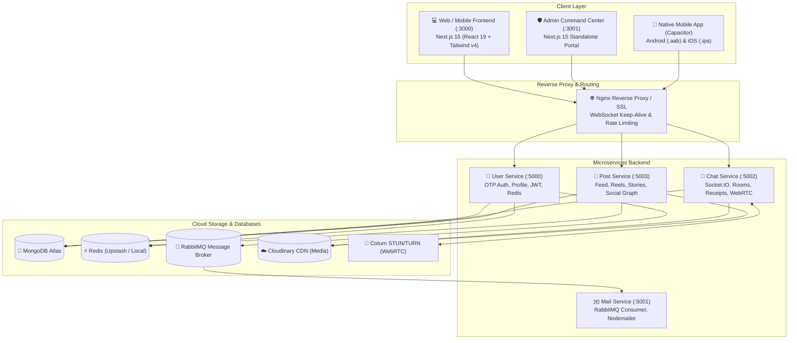

<div align="center">

# ⚡ Have-it Super-App

**Unified Real-Time Messenger + Instagram-Grade Social Ecosystem**  
*Built for Web, Desktop, Android, and iOS.*

[](https://nextjs.org/)
[](https://react.dev/)
[](https://www.typescriptlang.org/)
[](https://socket.io/)
[](https://tailwindcss.com/)
[](https://nodejs.org/)
[](https://www.mongodb.com/)
[](https://redis.io/)

</div>

---

## 📌 1. About the Project

**Have-it** is an enterprise-grade, event-driven communication and social media super-app inspired by the real-time speed of WhatsApp and Telegram combined with the visual engagement of Instagram.

It provides end-to-end real-time chat, multimedia messaging, voice notes with waveform scrubbing, WebRTC voice and video calls, 24-hour disappearing stories, a social feed with affinity-based ranking, and an enterprise Admin Command Center.

---

## 🏛️ 2. System Architecture



---

## ✨ 3. Key Feature Modules

### 💬 Real-Time Messenger (`frontend` & `backend/chat`)
- **Sub-50ms Messaging**: Persistent WebSockets with Socket.IO.
- **Message States**: Clock (sending) &rarr; Single grey tick (sent) &rarr; Double grey tick (delivered) &rarr; Double blue tick (seen).
- **Voice Notes**: In-browser audio recording using MediaRecorder API with interactive waveform scrubbing.
- **Quote Replies & Emoji Reactions**: Swipe/hover to reply, instant reaction badges.
- **Group Conversations**: Group creation, admin promotion/demotion, member management.
- **Message Editing & Deletion**: "Delete for me" and "Delete for everyone", with 15-minute edit windows.

### 📞 WebRTC Audio & Video Calling
- 1-on-1 P2P encrypted voice and video calls directly within the browser/app.
- Socket.IO signaling gateway with STUN/TURN NAT traversal.
- Screen sharing, camera switching, mute/unmute, and picture-in-picture call overlay.

### 📸 Social Hub & Stories (`backend/post`)
- **24-Hour Ephemeral Stories**: Instagram-style circular story tray with auto-expiry.
- **Media Feed**: Image and video posts with carousel layouts, caption formatting, and tags.
- **Engagement**: Double-tap like animations, nested comments, and personal bookmarks.
- **Social Graph**: Follow/Unfollow system with live follower and following counters.

### 🛡️ Enterprise Admin Command Center (`admin`)
- Standalone portal on Port 3001 with physical network isolation.
- Real-time DB analytics and platform health telemetry.
- User management and content moderation queue.
- Cloud API & Webhooks Studio for B2B programmatic messaging.

---

## 📁 4. Repository Structure

```
Chat App/
├── admin/                         # 🛡️ Admin Command Center (Next.js 15, Port 3001)
├── backend/
│   ├── chat/                      # 💬 Chat & WebRTC Signaling Service (Port 5002)
│   ├── mail/                      # ✉️ Mail Dispatch Worker (RabbitMQ Consumer, Port 5001)
│   ├── post/                      # 📸 Posts, Stories & Social Graph Service (Port 5003)
│   └── user/                      # 👤 User & OTP Authentication Service (Port 5000)
├── docs/                          # 📚 Comprehensive Architecture & Deployment Docs
│   ├── README.md                  # Master Documentation Index
│   ├── admin/                     # Admin specs, RBAC & Cloud API documentation
│   ├── architecture/              # System design, feed algorithm & monetization
│   ├── chats/                     # Historical chat phase summaries
│   ├── deployment/                # 🚀 VPS hosting, Docker, Play Store & App Store guide
│   ├── logs/                      # Error tracking & repair logs
│   └── posts/                     # Posts roadmap & feed algorithm math
├── frontend/                      # 💻 User Web Client (Next.js 15, React 19, Port 3000)
├── scripts/                       # 🛠️ Maintenance & Automated Health Check Scripts
├── .gitignore                     # 🛡️ Root Git ignore rules (protects all secrets)
├── CONTRIBUTING.md                # 🤝 Contributing guidelines
└── README.md                      # 📖 Project Master Readme (This file)
```

---

## 🚀 5. Quick Start (Local Development)

### Prerequisites
- **Node.js**: v20.x or higher
- **npm** or **yarn** / **pnpm**
- **MongoDB**: Local MongoDB or free [MongoDB Atlas](https://www.mongodb.com/) cluster
- **Redis**: Local Redis or free [Upstash Redis](https://upstash.com/)
- **RabbitMQ**: Local RabbitMQ or free [CloudAMQP](https://www.cloudamqp.com/)

---

### Step 1: Clone Repository
```bash
git clone https://github.com/<your-username>/have-it.git
cd have-it
```

---

### Step 2: Environment Variables
Copy the `.env.example` template in each service:

```bash
# Backend services
cp backend/user/.env.example backend/user/.env
cp backend/chat/.env.example backend/chat/.env
cp backend/post/.env.example backend/post/.env
cp backend/mail/.env.example backend/mail/.env

# Frontends
cp admin/.env.example admin/.env.local
cp frontend/.env.example frontend/.env.local
```
Fill in your database URIs, JWT secret, Cloudinary keys, and SMTP email credentials.

---

### Step 3: Install Dependencies & Run

Run each service in separate terminals (or configure your preferred process orchestrator):

| Service | Directory | Command | Default URL |
| :--- | :--- | :--- | :--- |
| **User Service** | `backend/user` | `npm install && npm run dev` | `http://localhost:5000` |
| **Mail Service** | `backend/mail` | `npm install && npm run dev` | `http://localhost:5001` |
| **Chat Service** | `backend/chat` | `npm install && npm run dev` | `http://localhost:5002` |
| **Post Service** | `backend/post` | `npm install && npm run dev` | `http://localhost:5003` |
| **Frontend Web** | `frontend` | `npm install && npm run dev` | `http://localhost:3000` |
| **Admin Console** | `admin` | `npm install && npm run dev` | `http://localhost:3001` |

---

## 🛠️ 6. Automated Diagnostics

To verify the health and integrity of all services, configs, and dependencies, run:

```bash
node scripts/system_health_check.js
```
The report will be automatically logged to `docs/logs/ERROR_TRACKING_AND_REPAIR_LOG.md`.

---

## 🌐 7. Production Hosting & Mobile App Stores

Complete step-by-step guides for:
- Deploying to a Linux VPS with Docker Compose & Nginx
- Configuring WebSockets and WebRTC TURN media traversal
- Packaging the Next.js frontend with **Capacitor** for Android & iOS
- Submitting to **Google Play Store** (20-tester rule compliance)
- Submitting to **Apple App Store** (review guidelines compliance)

👉 Read the full manual: **[Production Server Hosting & Mobile App Store Publishing Guide](docs/deployment/PRODUCTION_HOSTING_AND_APP_STORE_GUIDE.md)**

---

## 📄 8. License

This project is licensed under the ISC License.
