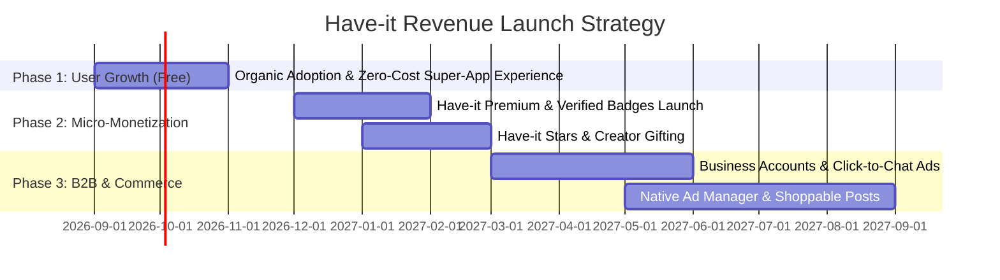

# Have-it Super-App — Monetization Models & Zero-Cost Architecture Blueprint

> **Objective**: Scale Have-it into a high-revenue, profitable global business while maintaining an intuitive, user-friendly UI and a near-zero initial infrastructure operating cost.

---

## 1. Zero-Cost Infrastructure & Microservices Operation

To ensure Have-it scales smoothly without high server bills during development and early-stage growth, the architecture leverages zero-cost, open-source, and high-efficiency tiering:

```
┌────────────────────────────────────────────────────────────────────────────────────────┐
│                                ZERO-COST CLOUD TOPOLOGY                                │
├────────────────────────────┬─────────────────────────────┬─────────────────────────────┤
│ Component                  │ Technology & Tier           │ Cost Strategy               │
├────────────────────────────┼─────────────────────────────┼─────────────────────────────┤
│ Frontend                   │ Next.js 15 (Vercel / Node)  │ Free Tier (Global Edge CDN) │
│ Microservices (User, Chat, │ Node.js + Express (Docker / │ Free/Low-tier VPS or Render/│
│ Post, Mail Worker)         │ PM2 Cluster)                │ Oracle Cloud 24GB Free Tier │
│ Database                   │ MongoDB Atlas / Self-hosted │ Free Tier (512MB) -> Self M │
│ Media Storage (Photos/Vid) │ Cloudinary Free Tier / S3   │ 25GB Storage + CDN included │
│ Real-Time Sockets & Chat   │ Socket.IO (In-Memory Node)  │ Zero bandwidth cost         │
│ Audio & Video Calls        │ WebRTC Peer-to-Peer         │ 0 Server Bandwidth (Direct) │
│ In-Memory Caching          │ Open-Source Redis           │ Runs locally / $0 container │
└────────────────────────────┴─────────────────────────────┴─────────────────────────────┘
```

### Why This Stack Costs $0 Initially:
1. **WebRTC Direct Peer-to-Peer Calling**: Audio and video streams flow directly between devices—your servers never process heavy video streams, saving thousands of dollars in media bandwidth.
2. **Single Server / Container Orchestration**: All 3 microservices (`user`, `chat`, `post`) run as lightweight Node.js processes communicating on internal loopback ports (`5000`, `5001`, `5002`), requiring only 1GB-2GB RAM.
3. **Cloudinary Smart Auto-Compression**: Images and videos are compressed at the edge, dramatically cutting storage and bandwidth.

---

## 2. Master Monetization Strategy: 6 High-Revenue Streams

Combining **Telegram/WhatsApp (Messenger)** with **Instagram (Social Hub)** creates a powerful hybrid monetization model:

```
                                  ┌──────────────────────────────────────────┐
                                  │      HAVE-IT MONETIZATION ENGINE         │
                                  └────────────────────┬─────────────────────┘
                                                       │
         ┌───────────────────┬─────────────────────────┼─────────────────────────┬───────────────────┐
         │                   │                         │                         │                   │
┌────────▼────────┐ ┌────────▼────────┐       ┌────────▼────────┐       ┌────────▼────────┐ ┌────────▼────────┐
│ Have-it Premium │ │ Creator Gifting │       │ Promoted Posts  │       │ Paid Subscribed │ │ Have-it Business│
│  Subscriptions  │ │ & Virtual Stars │       │ & Native Ads    │       │ Channels/Groups │ │  API & Verified │
│  ($3.99 - $7.99)│ │ (15-30% Cut)    │       │ (Self-Serve Ad) │       │ (10-20% Cut)    │ │ ($15 - $99/mo)  │
└─────────────────┘ └─────────────────┘       └─────────────────┘       └─────────────────┘ └─────────────────┘
```

---

### Stream 1: Have-it Premium (Subscription Model)
*Inspired by Telegram Premium & X Premium ($3.99 – $7.99/month)*

Users subscribe for exclusive status and enhanced capabilities:
- **Glowing `#03cafc` Animated Verified Badge** beside their name in chats, comments, and posts.
- **Ultra-HD 4K Media Uploads** & up to 4GB file sharing (standard free is 50MB).
- **Voice-to-Text Transcription**: 1-tap AI transcription of voice notes in chat.
- **Profile Customization**: Animated profile avatars, exclusive story gradient borders, and custom chat wallpapers.
- **No Ads**: Ad-free experience across the feed and explore grid.
- **Story Boost**: Stories pinned at the front of the top stories bar.

> **Revenue Potential**: 100,000 active subscribers @ $4.99/mo = **$499,000 / month ($5.98M / year)**.

---

### Stream 2: Creator Economy & In-App Gifting ("Have-it Stars")
*Inspired by TikTok Coins, Instagram Gifts, and Telegram Stars*

- Users purchase **Have-it Stars** packs (e.g., 100 Stars = $1.99, 1,000 Stars = $14.99).
- Fans send animated gifts (Glow Hearts, Super Trophies, Rockets) on:
  - High-quality **Posts & Reels**
  - **Live Streams & Stories**
  - Inside **Direct Message chats**
- Creators cash out stars to real currency; **Have-it retains a 20% to 30% platform fee**.

> **Revenue Potential**: High-velocity micropayments generated continuously on viral content.

---

### Stream 3: Paid Creator Channels & VIP Group Subscriptions
*Inspired by OnlyFans, Patreon, and Telegram Paid Channels*

- Creators, educators, crypto analysts, and fitness trainers can create **Exclusive VIP Groups & Paid Channels**.
- Subscribers pay a monthly fee (e.g., $9.99/month) to access exclusive posts, private chat discussions, and behind-the-scenes stories.
- Have-it handles automated billing and takes a **10% to 15% transaction commission**.

---

### Stream 4: Self-Serve Native Ads & Promoted Content
*Inspired by Instagram Ads & Facebook Ads Manager*

- Businesses, brands, and content creators can promote:
  - **Sponsored Feed Posts** (marked with subtle "Sponsored" badge).
  - **Promoted Stories & Reels** targeting specific demographics, interests, and locations.
  - **"Click to Have-it Chat" Ads**: Ads that immediately open a direct conversation between the buyer and the business with an automated welcome message.
- Self-serve dashboard with minimum $5 budget per campaign.

> **Revenue Potential**: In digital advertising, CPM (cost per 1,000 views) ranges from $2 to $10. At 50M daily feed impressions, this generates **$100,000+ / day**.

---

### Stream 5: Have-it for Business & Verified Business Badges
*Inspired by WhatsApp Business & Meta Verified ($14.99 – $99/month)*

Tailored for merchants, shops, e-commerce sellers, and influencers:
- **Verified Business Gold/Cyan Badge**: Establishes trust and authenticity.
- **Product Catalog Showcase**: Store catalog attached directly to their profile and post tags.
- **Automated Customer Service Chatbots**: Auto-replies, business hours, order status tracking in chat.
- **Broadcast Marketing**: Send promotional updates to opt-in follower lists.

---

### Stream 6: Social Commerce & In-Chat Checkout
*Inspired by WeChat Pay & Instagram Shop*

- Creators and businesses tag products in their **Posts, Reels, and Stories**.
- Users tap "Buy Now" $\rightarrow$ opens product card $\rightarrow$ complete order directly in chat.
- Have-it earns a **2.5% transaction processing fee** per successful sale.

---

## 3. How 100% Free Users Generate Massive Revenue (No Subscription Needed)

Even if **99% of your users never pay a single cent and use Have-it completely free**, you still make substantial revenue simply from their **app downloads, daily usage, and scrolling attention**:

```
 1,000,000 Free Users Scrolling Feed / Watching Stories
                          │
         ┌────────────────┴────────────────┐
         │                                 │
┌────────▼────────────────────────┐ ┌──────▼────────────────────────┐
│ Programmatic CPM Ads            │ │ Enterprise / B2B Utility Fees  │
│ (Google AdMob / Native Ads)     │ │ (Businesses pay to reach users)│
│ - 6 Ad Views/user/day           │ │ - Banks, Airlines, E-Commerce  │
│ - 6,000,000 Ad Impressions/day │ │ - $0.02 - $0.05/conversation   │
│ $\rightarrow$ $18,000 - $36,000 / day │ │ $\rightarrow$ $200,000+ / month        │
│ $\rightarrow$ $540,000 - $1.08M / mo   │ └────────────────────────────────┘
└─────────────────────────────────┘
```

### 1. Programmatic Ad Impressions (CPM Revenue — Google AdMob / Unity / Custom)
- **How It Works**: Every 4th or 5th post in the feed or story swipe is an automated programmatic advertisement.
- **You get paid simply when the ad appears on the screen (Impression)**. The user does not need to click or buy anything.
- **The Real Numbers**:
  - **100,000 Free Active Users**: Viewing 30 posts/stories a day = 600,000 daily ad impressions $\rightarrow$ **$1,800 to $3,600 / day ($54,000 to $108,000 / month)**.
  - **1,000,000 Free Active Users**: 6,000,000 daily ad impressions $\rightarrow$ **$18,000 to $36,000 / day ($540,000 to $1.08M / month)**.

### 2. The WhatsApp Business API Model (Businesses Pay For Free Users)
- **How WhatsApp Makes Billions with 100% Free Users**: Regular users talk to friends for free. But when a bank sends an OTP, Amazon sends a delivery update, or an airline sends a boarding pass inside Have-it, **the business pays Have-it $0.015 to $0.05 per conversation**.
- 5 million free users receiving 3 business notifications/month = **$300,000 to $600,000 / month paid entirely by companies**.

### 3. Sponsored Search & Trending Hashtags in Explore
- Brands and influencers pay to have their hashtag (e.g. `#NikeSummer`, `#TechLaunch`) or profile pinned at the top of the Explore page and search suggestions.

### 4. User Base Asset Value ($50 – $200 per Active User)
- In tech and social media, your company's valuation is driven by active users (DAU/MAU):
  - **Instagram** was acquired by Meta for **$1 Billion** when it had 30M free users and $0 revenue.
  - **WhatsApp** was acquired for **$19 Billion** with 100% free users.
  - Having 1M active free users gives Have-it an estimated market asset valuation of **$50 Million to $100 Million+**.

---

## 4. Revenue Roadmap: Step-by-Step Growth Timeline



---

## 5. Summary: How You Win Against Competitors

| Feature | WhatsApp | Telegram | Instagram | **Have-it Super-App** |
|---|---|---|---|---|
| **Real-Time Messenger & Calls** | ✅ Yes | ✅ Yes | ⚠️ Limited DM | **✅ Full WebRTC Calls + Messenger** |
| **Social Feed, Reels & Stories** | ❌ No Feed | ⚠️ Limited | ✅ Yes | **✅ Full Instagram Clone Hub** |
| **Creator Likes/Viewers Transparency** | ❌ No | ❌ No | ❌ Hidden | **✅ 100% Full Transparency List** |
| **Story DM Bridge to Chat** | ❌ No | ❌ No | ⚠️ Partial | **✅ Rich Interactive Message Cards** |
| **Zero-Cost Deployment Footprint** | ❌ Heavy | ❌ Heavy | ❌ Proprietary | **✅ Microservices (Lightweight & Modular)** |
| **Multiple Monetization Options** | ⚠️ Business | ⚠️ Premium | ⚠️ Ads only | **✅ Premium + Ads + Stars + Business** |
