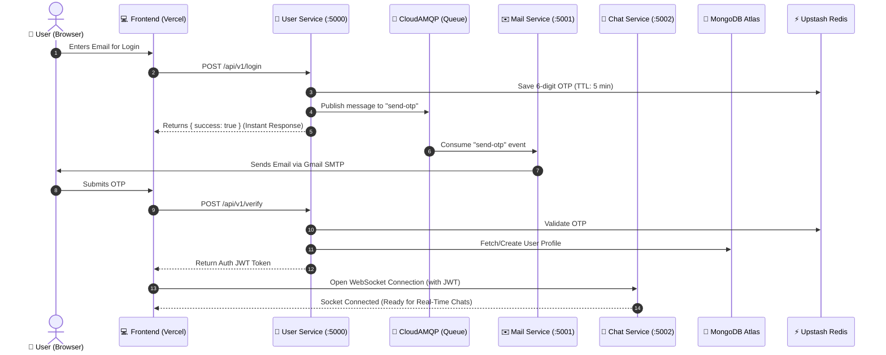

# 🏛️ Have-it Super-App — Cloud Infrastructure & Services Directory

> **Central Reference Manual of All External Cloud Services, Accounts, and Architecture Choices**  
> Primary Account / Owner Email: **`arnabroy466@gmail.com`**  
> Last Verified: **September 2026**

---

## 📑 Table of Contents

1. [Executive Summary & Design Philosophy](#1-executive-summary--design-philosophy)
2. [Master Accounts & Services Summary Table](#2-master-accounts--services-summary-table)
3. [Deep-Dive: What We Are Using & Why](#3-deep-dive-what-we-are-using--why)
   - [3.1 MongoDB Atlas (Core Database)](#31-mongodb-atlas-core-database)
   - [3.2 Upstash Redis (In-Memory Cache & Session Broker)](#32-upstash-redis-in-memory-cache--session-broker)
   - [3.3 CloudAMQP (RabbitMQ Message Broker)](#33-cloudamqp-rabbitmq-message-broker)
   - [3.4 Cloudinary (Media Storage & Optimization CDN)](#34-cloudinary-media-storage--optimization-cdn)
   - [3.5 Gmail SMTP / Nodemailer (Transactional Mail Dispatch)](#35-gmail-smtp--nodemailer-transactional-mail-dispatch)
   - [3.6 Vercel (Edge Hosting for Next.js Frontends)](#36-vercel-edge-hosting-for-nextjs-frontends)
   - [3.7 Render.com (Containerized Microservices Compute)](#37-rendercom-containerized-microservices-compute)
   - [3.8 cron-job.org / UptimeRobot (Heartbeat & Keep-Alive Daemon)](#38-cron-joborg--uptimerobot-heartbeat--keep-alive-daemon)
   - [3.9 Socket.IO (Real-Time Bi-Directional WebSockets Gateway)](#39-socketio-real-time-bi-directional-websockets-gateway)
4. [Cross-Service Data Flow Diagram](#4-cross-service-data-flow-diagram)
5. [Emergency Recovery & Maintenance Procedures](#5-emergency-recovery--maintenance-procedures)

---

## 1. Executive Summary & Design Philosophy

The **Have-it** platform combines an end-to-end real-time messenger with a modern social media feed. The entire system was designed around three non-negotiable principles:

1. **Strict Service Decoupling (Microservices)**: Authentication (`user-service`), real-time communication (`chat-service`), social feed (`post-service`), and notifications (`mail-service`) are isolated so an issue in one feature never crashes the others.
2. **Zero-Cost Production Architecture**: Every tier utilizes generous cloud-managed free tiers (MongoDB Atlas M0, Upstash Serverless, CloudAMQP Little Lemur, Cloudinary, Vercel Hobby, Render Web Services).
3. **Resilience & Fault Tolerance**: Asynchronous message queues buffer traffic spikes, serverless caches eliminate slow database lookups, and automated health checks prevent idle cloud spin-downs.

---

## 2. Master Accounts & Services Summary Table

| Service / Platform | Purpose in Have-it | Account Email | Dashboard URL | Env Variable(s) |
| :--- | :--- | :--- | :--- | :--- |
| **MongoDB Atlas** | Primary NoSQL database (Users, Chats, Posts, Messages) | `arnabroy466@gmail.com` | [cloud.mongodb.com](https://cloud.mongodb.com) | `MONGO_URI` |
| **Upstash Redis** | High-speed cache, OTP storage with auto-expiry, rate limits | `arnabroy466@gmail.com` | [console.upstash.com](https://console.upstash.com) | `REDIS_URL` |
| **CloudAMQP** | Asynchronous RabbitMQ broker for background mail tasks | `arnabroy466@gmail.com` | [customer.cloudamqp.com](https://customer.cloudamqp.com) | `RABBITMQ_URL` |
| **Cloudinary** | Cloud CDN for avatars, chat images, stories, and post videos | `arnabroy466@gmail.com` | [cloudinary.com/console](https://cloudinary.com/console) | `CLOUD_NAME`, `CLOUD_API_KEY`, `CLOUD_API_SECRET` |
| **Google Gmail SMTP** | Transactional delivery of 6-digit OTP verification codes | `arnabroy466@gmail.com` | [myaccount.google.com/apppasswords](https://myaccount.google.com/apppasswords) | `Nodemailer_User`, `Nodemailer_Pass` |
| **Vercel** | Hosting Next.js 15 Web App (`frontend`) & Admin Panel (`admin`) | `arnabroy466@gmail.com` | [vercel.com/dashboard](https://vercel.com/dashboard) | Managed via Vercel Dashboard |
| **Render.com** | Hosting Node.js microservices (`user`, `chat`, `post`, `mail`) | `arnabroy466@gmail.com` | [dashboard.render.com](https://dashboard.render.com) | Service settings & Env blocks |
| **cron-job.org** | 10-minute automated ping to prevent cloud services from sleeping | `arnabroy466@gmail.com` | [cron-job.org](https://cron-job.org) | None (External monitor) |

---

## 3. Deep-Dive: What We Are Using & Why

### 3.1 MongoDB Atlas (Core Database)
* **What It Is**: Fully-managed cloud MongoDB cluster hosted on AWS (Cluster0).
* **Why We Are Using It**:
  - Flexible document model perfectly fits unstructured real-time chat data (e.g. quote-replies, emoji reactions, message types) and rich social media posts.
  - Native Mongoose ORM models handle relationships between users, conversations, and posts.
* **What Data It Stores**:
  - `User`: Accounts, hashed tokens, roles (`user`, `admin`, `super_admin`), theme preferences, bio.
  - `Chat` & `Messages`: 1-on-1 chats, group chats, attachments, delivery status (`seen`, `delivered`), timestamps.
  - `Post`, `Comment`, `Story`, `Follow`: Social feed items, likes, comments, and 24-hour disappearing stories.
  - `SystemConfig`: Platform configuration, maintenance flags, announcement banners.
* **Important Safety Rule**: Atlas M0 free tier automatically pauses if there are **60 days with zero connections**. The automated heartbeat ping prevents this permanently.

---

### 3.2 Upstash Redis (In-Memory Cache & Session Broker)
* **What It Is**: Serverless, low-latency Redis database accessible via secure TLS (`rediss://`).
* **Why We Are Using It**:
  - **Lightning-Fast OTPs**: When a user requests a login code, saving it in Redis with a 5-minute TTL (`EX 300`) avoids slow disk writes to MongoDB and guarantees automated deletion upon expiry.
  - **Rate Limiting**: Protects authentication endpoints from brute-force login attempts without taxing MongoDB.
  - **Post Feed Caching**: Caches user feeds and profile data to deliver instantaneous page loads.
* **Free Tier Quota**: 10,000 commands per day (our automated heartbeat uses only 144 requests/day, or ~1.4%).

---

### 3.3 CloudAMQP (RabbitMQ Message Broker)
* **What It Is**: Cloud-hosted RabbitMQ cluster ("Little Lemur" instance named `khjhccgj` on `puffin.rmq2.cloudamqp.com`).
* **Why We Are Using It**:
  - **Asynchronous Decoupling**: Sending an email via SMTP takes 1.5 to 3.5 seconds. If the user service handled email sending synchronously, user registration would hang and timeout during network delays.
  - Instead, `user-service` publishes a message to the `send-otp` queue in **under 5 milliseconds** and immediately responds to the user. `mail-service` pulls from this queue in the background and dispatches the email.
  - Eliminates the need to run heavy RabbitMQ container instances locally or on server memory.

---

### 3.4 Cloudinary (Media Storage & Optimization CDN)
* **What It Is**: Cloud-based media storage and high-speed delivery CDN.
* **Why We Are Using It**:
  - Web servers and Docker containers are ephemeral: files uploaded to local container disk are erased whenever a container restarts or updates.
  - Cloudinary securely hosts images, voice notes, and videos, returning secure HTTPS URLs (`res.cloudinary.com/...`).
  - Automatically handles on-the-fly image optimization, responsive resizing, and format conversion (WebP/AVIF).
* **Used Across**:
  - User profile avatars (`backend/user`)
  - Chat image attachments, audio voice notes (`backend/chat`)
  - Post pictures, reel videos, story media (`backend/post`)

---

### 3.5 Transactional Mail Dispatch (Brevo HTTPS API & Gmail SMTP)
* **What It Is**: Multi-channel email delivery engine supporting:
  1. **Brevo (formerly Sendinblue) HTTPS API (Port 443)**: *Active for Render Cloud*. Sends up to 300 emails/day to **ANY recipient address** without requiring a custom domain!
  2. **Google Gmail SMTP (`smtp.gmail.com:465`)**: Used for local development environments via Nodemailer.
* **Why the HTTPS API Is Essential on Cloud Providers (Render)**:
  - Render free tier firewalls actively block all outbound raw TCP connections on SMTP ports 25, 465, and 587. Attempting to use SMTP results in an immediate `ETIMEDOUT: Connection timeout`.
  - Brevo HTTPS API transmits email requests securely over Port 443, which is universally permitted across all cloud hosts.
* **Configuration Switch**:
  - If `BREVO_API_KEY` is present in `mail-service` environment, it routes via Brevo HTTPS API.
  - Otherwise, it falls back to Nodemailer SMTP for local development.

---

### 3.6 Vercel (Edge Hosting for Next.js Frontends)
* **What It Is**: Serverless global hosting platform engineered specifically for Next.js applications.
* **Why We Are Using It**:
  - **Two Independent Deployments**:
    1. **Consumer Web App** (`frontend/`): Fully responsive mobile/desktop messenger and social hub.
    2. **Admin Command Center** (`admin/`): Dedicated administration dashboard for user management, moderation, and webhooks.
  - Automatic SSL certificates, global CDN edge caching, zero maintenance, and continuous automatic deployment on `git push`.

---

### 3.7 Render.com (Containerized Microservices Compute)
* **What It Is**: Cloud application platform running modern Linux containers.
* **Why We Are Using It**:
  - Native support for persistent **Socket.IO (WebSockets)** connections, which standard serverless hosts (like Vercel functions) do not support.
  - Automatically builds and runs each backend service directly from your GitHub repository using Docker or Node runtimes.

---

### 3.8 cron-job.org / UptimeRobot (Heartbeat & Keep-Alive Daemon)
* **What It Is**: Cloud monitoring service that triggers scheduled HTTP requests.
* **Why We Are Using It**:
  - Render free tier instances enter sleep mode after 15 minutes of zero web traffic.
  - MongoDB Atlas pauses free clusters after 60 days of inactivity.
  - Upstash Redis archives databases after 30 days of inactivity.
  - **The Fix**: Pings `GET /api/v1/system/config` every 10 minutes. This executes a tiny query in MongoDB, keeps Redis connected, and ensures the backend containers are warm and ready for instant user interaction.

---

### 3.9 Socket.IO (Real-Time Bi-Directional WebSockets Gateway)
* **What It Is**: Low-latency event-driven WebSocket layer embedded in `chat-service` (Port 5002).
* **Why We Are Using It**:
  - Replaces traditional HTTP polling with instantaneous real-time updates.
  - Powers:
    * Instant message delivery & reception
    * Live typing indicators (`user is typing...`)
    * Online/offline user presence tracking
    * Read receipts and double-check delivery markers
    * WebRTC signaling for peer-to-peer voice/video calls

---

### 3.10 Social Single Sign-On (Google & Microsoft OAuth 2.0)
* **What It Is**: Direct OAuth 2.0 / OpenID Connect authentication integration for Google Accounts and Microsoft Entra (Azure AD).
* **Scope**: **Frontend only** (explicitly excluded from Admin panel for maximum security).
* **User Flow**:
  1. User clicks **"Continue with Google"** or **"Continue with Microsoft"** on `/login`.
  2. Browser navigates to `/api/v1/auth/google` or `/api/v1/auth/microsoft` on `user-service`.
  3. Provider prompts user for authorization and redirects back with an authorization `code`.
  4. Backend exchanges `code` for user profile (ID, verified email, name, avatar), finds or creates user in MongoDB Atlas, generates Have-it JWT token, and redirects to `${FRONTEND_URL}/oauth-callback?token=${token}`.
  5. The callback handler writes the token cookie and opens the main `/chat` interface.
* **Fallback Behavior**:
  - Standard 6-digit OTP verification code via email remains fully functional as the primary login method.
  - If Google or Microsoft credentials have not yet been added to the backend environment, the system displays a graceful error toast without crashing.

## 4. Cross-Service Data Flow Diagram



---

## 5. Emergency Recovery & Maintenance Procedures

### 5.1 If Login Emails Stop Delivering
1. Open [Google App Passwords](https://myaccount.google.com/apppasswords) using `arnabroy466@gmail.com`.
2. Generate a new App Password for "Mail".
3. Update `Nodemailer_Pass` in `backend/mail/.env` and on Render.

### 5.2 If MongoDB Connection Fails
1. Log into [MongoDB Atlas](https://cloud.mongodb.com).
2. Go to **Network Access** -> Ensure `0.0.0.0/0` (Allow from anywhere) is Active.
3. Check if the cluster shows as "Paused". If so, click **Resume**.

### 5.3 If CloudAMQP Connection Drops
1. Open [CloudAMQP Console](https://customer.cloudamqp.com).
2. Verify instance `khjhccgj` state is green/operational.
3. If credentials were reset, copy the new AMQP URL and update `RABBITMQ_URL`.

### 5.4 Running Full System Diagnostic
To check all services, files, and configurations at once locally:
```powershell
node scripts/system_health_check.js
```
The script will audit every component and output results to [`docs/logs/ERROR_TRACKING_AND_REPAIR_LOG.md`](file:///D:/Chat%20App/docs/logs/ERROR_TRACKING_AND_REPAIR_LOG.md).
