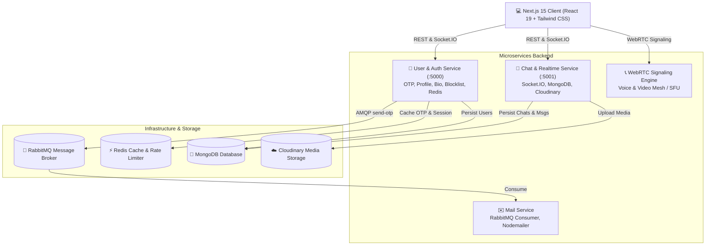

# ⚡ Have-it - Master Project Roadmap & Universal Architecture Specification

---

## 📌 1. Project Overview & Architecture

**Have-it** is a **Universal Cross-Platform Real-Time Messenger** (Web, Desktop & All Mobile OS) built on a scalable, event-driven microservices architecture. Inspired by the best capabilities Have-it and Telegram, it delivers enterprise-grade real-time messaging, rich multimedia exchange, voice notes, WebRTC audio/video calls, group chats, ephemeral status stories, and multi-device cross-platform synchronization.

---

### 🛠️ Technology Stack

| Layer | Technology | Key Capabilities & Role |
| :--- | :--- | :--- |
| **Frontend** | Next.js 15 (App Router), React 19, Tailwind CSS v4, Lucide Icon Have-it 3-panel UI, responsive layout, dark/light themes, offline caching |
| **State & Context** | React Context API, Custom Hooks, Cookie Manager | Auth state, Active chat state, Real-time Socket sync, Call state |
| **Real-Time Engine** | Socket.IO Client / Server (WebSockets + Polling fallback) | Sub-50ms message delivery, typing indicators, presence, live ticks, reactions |
| **Audio & Media** | Web Audio API, MediaRecorder API, WaveSurfer.js | Voice note recording, audio waveform visualization, sound FX |
| **Calling (VoIP)** | WebRTC (RTCPeerConnection), Socket.IO Signaling | 1-on-1 real-time voice and video calling with screen share |
| **User Service** | Node.js, Express, TypeScript, MongoDB, Redis, JWT | OTP authentication, rate limiting, user profiles, status bio, blocklist |
| **Chat Service** | Node.js, Express, TypeScript, MongoDB, Multer, Cloudinary | 1-on-1 & group chats, message history, media storage, seen receipts |
| **Mail Service** | Node.js, TypeScript, RabbitMQ (amqplib), Nodemailer | Async background OTP email delivery |
| **Message Broker / Cache** | RabbitMQ (AMQP), Redis (In-Memory Data Store) | Asynchronous task queues, OTP verification cache, presence cache |

---

## 📊 2. Current Status & Gap Analysis

### ✅ What is Completed
- [x] **User Service**:
  - Email-based OTP login endpoint with Redis caching (5-minute TTL) and 60-second rate limiting.
  - RabbitMQ publisher integration for asynchronous OTP mailing.
  - OTP validation, user creation, and JWT token issuance.
  - User retrieval (`/me`, `/user/all`, `/user/:id`) and name update endpoints.
- [x] **Mail Service**:
  - RabbitMQ `send-otp` queue consumer.
  - SMTP email dispatch using Nodemailer.
- [x] **Chat Service (REST Base)**:
  - MongoDB database connection and models for `Chat` and `Messages`.
  - REST endpoints for creating chats, fetching chat lists with unread count, and loading message history.
  - Cloudinary storage and Multer middleware configuration.
- [x] **Frontend (Base UI)**:
  - Dark-mode responsive layout.
  - Login page and 6-digit OTP verification UI with auto-focus, paste, and countdown timer.
  - Sidebar with conversation list and user search modal.

---

### ⚠️ Current Bugs & Critical Gaps to Address

#### 🔴 Critical Blockers
1. **Missing Message Input Bar**: Chat interface has no input field, file upload button, or voice recorder.
2. **Missing Socket.IO Engine**: Real-time message exchange, live typing, and instant read receipts are not active.
3. **Missing Profile Route (`/profile`)**: Sidebar links to `/profile` which results in a 404.

#### 🐛 Code Bugs
1. **Multer MIME Filter Bug** (`backend/chat/src/middlewares/multer.ts:18`): `file.mimetype.startsWith("/image/")` causes all image uploads to fail due to the leading slash.
2. **Message Schema Inconsistency** (`backend/chat/src/models/Messages.ts`): `text` is required, breaking image-only and audio-only messages. Field naming mismatch (`type` vs `messageType`).
3. **Self-Comparison Bug** (`backend/chat/src/controller/chat.ts:204`): Shadowed variable causes participant check to always evaluate to true.
4. **User Model Typo** (`backend/user/src/model/User.ts:22`): Model registered as `"Üser"` with an umlaut.
5. **Frontend Context State Bug** (`frontend/src/context/Appcontext.tsx:68`): `setUser(data)` stores `{ user: { ... } }` instead of `data.user`.

---

## 🗓️ 3. Phased Implementation Roadm Have-it Parity)

---

### 🔹 Phase 1: Core Bug Fixes & Message Input Bar (MVP Baseline)
> **Goal**: Enable end-to-end text and image message dispatch from the UI.

- [x] **Fix Backend Bugs**:
  - Update `multer.ts` MIME filter to `file.mimetype.startsWith("image/")` and support audio/document formats.
  - Update `Messages.ts` schema: make `text` optional, add `mediaUrl`, `mediaType`, and `fileSize`.
  - Correct `isUserInChat` participant comparison in `chat.ts`.
  - Fix `"Üser"` typo in `backend/user/src/model/User.ts`.
- [x] **Fix Frontend Auth Context**:
  - Correct `setUser(data.user)` in `Appcontext.tsx`.
  - Guard `fetchChats()` and `fetchAllUsers()` so they execute only when an auth token exists.
- [x] **Bu Have-it Message Input Bar (`ChatInput.tsx`)**:
  - Text input with auto-expanding multiline support (`Shift+Enter` for new line, `Enter` to send).
  - Send button w Have-it green theme and icon transitions.
  - Attachment button with popup menu (Photos & Videos, Documents, Camera).
  - Image upload modal preview with caption input before sending.
  - Optimistic message rendering in the message stream.

---

### 🔹 Phase 2: Real-Time Engine & Presence (Socket.IO)
> **Goal**: Sub-second live communication, real-time presence, and status ticks.

- [x] **Backend Socket.IO Setup (`backend/chat`)**:
  - Install `socket.io` and configure HTTP server wrapper.
  - Add JWT authentication handshake middleware for socket connections.
  - Implement Redis/In-Memory user connection tracking (`userId` ↔ `socketId` set).
  - Implement core socket handlers:
    - `setup` / `disconnect`: Track and broadcast online/last-seen status.
    - `join_chat`: Join room for active conversation.
    - `send_message` / `receive_message`: Instant message dispatch.
    - `typing` / `stop_typing`: Real-time typing indicators.
    - `mark_as_seen`: Instant read status updates.
- [x] **Frontend Socket.IO Integration**:
  - Create `SocketContext.tsx` providing connection status, online users list, and typing events.
  - Wire incoming messages to conversation list (update snippet, timestamp, unread counter) and chat window.
  - Live header indicator: `"Online"` / `"Last seen at..."` / `"typing..."`. Have-it ticks on messages:
    - 🕒 Clock: Sending / Pending
    - ✔️ Single Grey Tick: Sent to server
    - ✔️✔️ Double Grey Tick: Delivered to recipient
    - 🔵 Double Blue Tick: Seen / Read by recipient

---

### 🔹 Phase Have-it Rich Chat Interactions
> **Goal**: Message reactions, voice notes, quote replies, and message actions.

- [x] **Voice / Audio Notes**:
  - Mic button on input bar: hold/click to record using `MediaRecorder API`.
  - Recording state UI: live recording timer, wave visualizer, cancel (trash bin), and send buttons.
  - Custom audio player in message bubble with waveform scrubber (`WaveSurfer.js` / HTML5 Canvas), play/pause, playback speed toggle (`1x`, `1.5x`, `2x`), and duration.
- [x] **Quote / Reply to Message**:
  - Swipe-to-reply (mobile) and hover action menu -> "Reply" (desktop).
  - Quoted message preview bar above the input box with dismiss button.
  - Render quoted message header inside the outgoing and incoming message bubbles with click-to-scroll to original message.
- [x] **Emoji Reactions**:
  - Quick reaction bar on hover (`👍`, `❤️`, `😂`, `😮`, `😢`, `🙏`, `➕`).
  - Reaction badges displayed at bottom-right of message bubble with count and user list popover.
- [x] **Message Deletion & Editing**:
  - "Delete for me" (local hide) and "Delete for everyone" (replaces message with *"This message was deleted"*).
  - Edit message (available within 15 minutes of sending, displays *"Edited"* tag).
- [x] **Emoji & GIF Picker**:
  - Integrated Emoji picker popover (supporting stand Have-it emoji skin tones).
  - Searchable emoji categories (Smileys, Gestures, Hearts, Fun).

---

### 🔹 Phase Have-it Authentic UI/UX & Profile Management
> **Goal**: Compl Have-it Web look, feel, themes, and navigation drawers.

- [x Have-it Signature Theme & Wallpaper**:
  - Offic Have-it subtle doodle background pattern with custom opacity for Dark and Light mode.
  - Color palette match Have-it Web (`#00a884` primary green, `#111b21` dark background, `#202c33` panel background). Have-it notification audio effects (incoming message tone, outgoing pop sound).
- [x] **Chat Navigation & Filter Pills**:
  - Filter pills above chat list: `All`, `Unread`, `Favourites`, `Groups`.
  - In-chat message search bar with match highlighting and up/down match navigation.
- [x] **Right-Side Contact / Chat Info Drawer**:
  - Click chat header to expand right panel:
    - User avatar, display name, email, and "About" bio.
    - Media, Links, and Docs tab view with categorized grid preview.
    - Mute notifications toggle, Starred messages view, Block contact button.
- [x] **Full User Profile Page (`/profile`)**:
  - Profile photo upload / change / remove with Cloudinary.
  - Editable display name and "About" bio (preset options: *"Available"*, *"Busy"*, *"At work"*, *"Battery about to die"* or custom).
  - Back navigation button to `/chat`.

---

### 🔹 Phase 5: Group Chats & Community Management
> **Goal**: Multi-user group conversations with administrative controls.

- [x] **Group Backend Architecture (`backend/chat`)**:
  - Update `Chat` schema: `isGroup: boolean`, `groupName: string`, `groupAvatar: string`, `groupAdmin: ObjectId[]`, `groupDescription: string`.
  - Group management endpoints: Create group, Add members, Remove members, Promote/Demote admin, Update group info.
- [x] **Group Chat Frontend UI**:
  - "New Group" modal: Multi-select contact picker, group subject/name input, and group avatar crop/upload.
  - Group message bubbles showing sender name and color-coded tags.
  - Group info drawer displaying participant list with "Admin" badges and action menu (Message, Make Admin, Remove).
  - Group read receipts breakdown (*"Read by..."*, *"Delivered to..."*).
  - `@mention` auto-complete popover when typing `@` in group chat.

---

### 🔹 Phase 6: WebRTC Real-Time Voice & Video Calling
> **Goal**: 1-on-1 high-definition audio and video calling directly inside the browser.

- [x] **WebRTC Signaling Gateway (`backend/chat` Socket.IO)**:
  - Signaling events: `call_user`, `call_accepted`, `call_rejected`, `ice_candidate`, `end_call`.
- [x] **Frontend Calling Interface**:
  - Header call action buttons (Voice Call 📞, Video Call 🎥).
  - Incoming Call dialog modal with Ringtone sound, caller avatar, and Accept / Decline controls.
  - Full-screen / Picture-in-Picture Call Overlay:
    - Local & remote video stream rendering (`<video>` elements).
    - Controls: Mute/Unmute Mic, Camera On/Off, Screen Share, Switch Camera, End Call.
  - Call connection state management (Calling, Ringing, Connected, Reconnecting, Ended).
  - Call history log tab (Incoming, Outgoing, Missed calls with timestamps).

---

### 🔹 Phase 7: Privacy, Security & DevOps Orchestration
> **Goal**: Production-ready deployment, privacy controls, and containerization.

- [ ] **Privacy & Safety Controls**:
  - Block / Unblock contact functionality.
  - Mute chat notifications (8 hours, 1 week, Always).
  - Disappearing messages toggle (24 hours, 7 days, 90 days per chat).
- [ ] **Containerization & Deployment**:
  - Standardized `.env.example` configurations across all services.
  - Root `docker-compose.yml` to orchestrate:
    - MongoDB, Redis, RabbitMQ.
    - User Service, Mail Service, Chat Service, Next.js Frontend.
    - Unified root `package.json` with npm workspaces or `concurrently` for one-command development (`npm run dev`).

---

## 📡 4. Comprehensive Socket.IO Event Specification

| Event Name | Direction | Payload | Description |
| :--- | :--- | :--- | :--- |
| `setup` | Client ➔ Server | `{ userId: string }` | Registers user socket session and updates status to Online |
| `get_online_users` | Server ➔ Client | `string[]` (Array of userIds) | Synchronizes list of currently connected online users |
| `user_status_change` | Server ➔ Client | `{ userId: string, status: "online" \| "offline", lastSeen?: Date }` | Broadcasts user presence changes |
| `join_chat` | Client ➔ Server | `chatId: string` | Subscribes socket to a specific conversation room |
| `send_message` | Client ➔ Server | `IMessagePayload` | Emits a new message (text, media, audio, quote) |
| `receive_message` | Server ➔ Client | `IMessage` | Delivers incoming message to chat room participants |
| `message_delivered` | Server ➔ Client | `{ messageId: string, chatId: string }` | Updates message status to double grey ticks |
| `mark_as_seen` | Client ➔ Server | `{ chatId: string, userId: string }` | Emits event when a user reads unread messages |
| `messages_seen_update`| Server ➔ Client | `{ chatId: string, seenBy: string, seenAt: Date }` | Updates message status to double blue ticks |
| `typing` | Client ➔ Server | `{ chatId: string, userId: string }` | Broadcasts typing state to room participants |
| `stop_typing` | Client ➔ Server | `{ chatId: string, userId: string }` | Broadcasts stopped-typing state |
| `add_reaction` | Client ➔ Server | `{ messageId: string, chatId: string, emoji: string }` | Attaches emoji reaction to message |
| `reaction_updated` | Server ➔ Client | `{ messageId: string, reactions: IReaction[] }` | Broadcasts updated reaction list |
| `message_deleted` | Server ➔ Client | `{ messageId: string, chatId: string, deleteType: "everyone" }` | Updates message content to deleted placeholder |
| `call_user` | Client ➔ Server | `{ userToCall: string, signalData: any, from: string, name: string, isVideo: boolean }` | Initiates WebRTC call signaling |
| `call_accepted` | Client ➔ Server | `{ signal: any, to: string }` | Accepts incoming WebRTC call and sends answer SDP |
| `call_rejected` | Client ➔ Server | `{ to: string }` | Declines incoming call |
| `ice_candidate` | Client ➔ Server | `{ to: string, candidate: any }` | Exchanges ICE network candidates |
| `end_call` | Client ➔ Server | `{ to: string }` | Terminates active WebRTC call |

---

## ⏱️ 5. Implementation Roadmap & Timeline

| Phase | Core Milestone | Estimated Effort | Status |
| :--- | :--- | :--- | :--- |
| **Phase 1** | Bug Fixes & Message Input UI (Text & Images) | 3 – 4 Hours | ✅ Completed |
| **Phase 2** | Real-Time Engine (Socket.IO, Presence & Ticks) | 6 – 8 Hours | ✅ Completed |
| **Phase 3** | Rich Interactions (Voice Notes, Reactions, Replies) | 8 – 10 Hours | ✅ Completed |
| **Phase 4** Have-it UI/UX Theme & Contact Info Drawer | 4 – 6 Hours | ✅ Completed |
| **Phase 5** | Group Chats & Community Administration | 6 – 8 Hours | ✅ Completed |
| **Phase 6** | WebRTC Audio & Video Calling | 10 – 12 Hours | ✅ Completed |
| **Phase 7** | Privacy, Security & Docker Orchestration | 4 – 6 Hours | Ready to Start |

---

*Master Roadmap updated Have-it Feature Parity Specification.*
