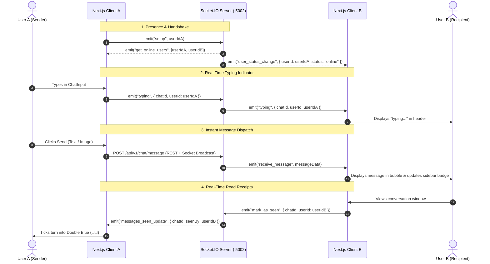

# ⚡ Phase 2 Execution Summary & Real-Time Testing Guide

---

## 📌 1. Overview of Phase 2 Work

Phase 2 established the **Real-Time WebSocket Engine (Socket.IO)** across the Chat Microservice and Next.js Frontend. It provides sub-second live message delivery, real-time online/offline presence tracking, dynamic typing indicators, and instant WhatsApp double-blue seen ticks without requiring page reloads.

---

## 🛠️ 2. File-by-File Changes Made

### 🔹 Backend Socket.IO Engine (`backend/chat`)

1. **`backend/chat/src/socket.ts` (NEW MODULE)**
   - Initialized Socket.IO server with CORS and JWT handshake token verification.
   - Built multi-device connection tracking with `Map<string, Set<string>>` (`userId` ↔ active `socketId` set).
   - Handled events:
     - `setup`: Registers user session, joins personal user room, broadcasts updated `get_online_users` and `user_status_change`.
     - `join_chat` / `leave_chat`: Subscribes/unsubscribes client to specific conversation rooms.
     - `typing` / `stop_typing`: Broadcasts live typing states to room participants.
     - `mark_as_seen`: Updates unseen messages in MongoDB and broadcasts `messages_seen_update`.
     - `disconnect`: Cleans up disconnected socket IDs and broadcasts offline status when user has 0 active tabs.

2. **`backend/chat/src/index.ts` (UPDATED)**
   - Wrapped Express application with Node's native `http.createServer(app)`.
   - Initialized Socket.IO via `initSocket(server)` on port 5002.

3. **`backend/chat/src/controller/chat.ts` (UPDATED)**
   - Integrated `getIO()` and `getReceiverSocketIds()`.
   - `sendMessage`: Emits `receive_message` to the chat room and emits `chat_updated` directly to the recipient's personal sockets.
   - `getMessagesByChat`: Automatically emits `messages_seen_update` when messages are read.

---

### 🔹 Frontend Real-Time Integration (`frontend`)

4. **`frontend/src/context/SocketContext.tsx` (NEW CONTEXT)**
   - Established persistent WebSocket connection to `http://localhost:5002` with auth token.
   - Tracks `onlineUsers: string[]` and exposes `isOnline(userId)`.
   - Manages typing state map (`typingMap`) with automatic 3-second inactivity debounce.
   - Exposes helper methods: `emitTyping`, `emitStopTyping`, and `markMessagesAsSeen`.

5. **`frontend/src/app/layout.tsx` (UPDATED)**
   - Mounted `<SocketProvider>` inside `<AppProvider>`.

6. **`frontend/src/app/chat/page.tsx` (UPDATED)**
   - Subscribes to chat rooms on active conversation select (`join_chat` / `leave_chat`).
   - Listens to incoming `receive_message` events and appends them in real-time with deduplication.
   - Listens to `messages_seen_update` and updates message ticks live.
   - Computes `isTyping` status from `typingMap` for the active conversation.

7. **`frontend/src/components/ChatSidebar.tsx` (UPDATED)**
   - Added glowing green presence dots (`bg-emerald-500`) to avatars when users are online.
   - Displays live `"online"` / `"offline"` status in the "New Chat" user search list.
   - Live update of conversation snippets, timestamps, and WhatsApp green unread badges.

8. **`frontend/src/components/ChatHeaders.tsx` (UPDATED)**
   - Displays real-time presence: `"online"` vs `"offline"`.
   - Displays pulsing green `"typing..."` text when the other participant is typing.

9. **`frontend/src/components/ChatInput.tsx` (UPDATED)**
   - Emits `emitTyping` as the user types in the textarea.
   - Emits `emitStopTyping` when the input is emptied or message is dispatched.

---

## 🧪 3. Step-by-Step Testing & Verification Guide

To verify full real-time communication, test with **two different user accounts in two separate browser windows**:

### 🚀 Step 1: Open Two Sessions
1. **Window A (User 1)**: Open Chrome and log in at `http://localhost:3000/login` with `user1@example.com`.
2. **Window B (User 2)**: Open Chrome Incognito (or Firefox/Edge) and log in with `user2@example.com`.

---

### 🟢 Step 2: Test Live Online Presence
1. Both users should see each other marked with a **green online dot** in the sidebar.
2. In the "New Chat" user search modal, verify the status reads `"online"`.
3. Close Window B (or log out User 2) ➔ In Window A, User 2's indicator immediately turns to `"offline"`.

---

### ✍️ Step 3: Test Real-Time Typing Indicator
1. In Window A, select User 2 to open the chat window.
2. In Window B, select User 1 to open the chat window.
3. In Window A, start typing in the input box without pressing Enter.
4. **Expected**: In Window B's chat header, the subtitle changes from `"online"` to an animated green `"typing..."`.
5. Stop typing for 3 seconds ➔ The status reverts back to `"online"`.

---

### 📩 Step 4: Test Instant Sub-Second Message Delivery
1. In Window A, type a message or select an image and press **Enter**.
2. **Expected**:
   - The message appears instantly in Window A with a grey tick (✔️).
   - The message appears **instantly in Window B without refreshing the page**.
   - Window B's sidebar latest message preview updates immediately.

---

### 🔵 Step 5: Test Real-Time Double Blue Read Receipts
1. In Window A, send a message while Window B is on a different chat (or not viewing).
2. **Expected**: Window A shows a single tick (✔️) and Window B shows a green unread badge (e.g. `1`).
3. Now in Window B, click on User 1's chat to open it.
4. **Expected**:
   - Window B's unread badge clears to `0`.
   - In Window A, the ticks immediately turn into **Double Blue Ticks (🔵🔵)** in real time!

---

## 📊 4. Build & Typecheck Status

| Project | Command | Status |
| :--- | :--- | :--- |
| `backend/chat` | `npm run build` | ✅ Passed (0 errors) |
| `frontend` | `npx tsc --noEmit` | ✅ Passed (0 errors) |

---
*Created on 2026-08-19. Reference documentation for Phase 2 implementation.*
