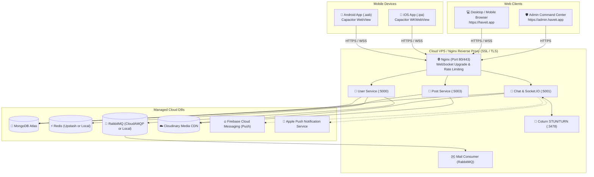

# 🚀 Have-it Super-App — Production Server Hosting & Mobile App Store Publishing Guide

> **Universal Deployment & Store Submission Manual**  
> Covers cloud server infrastructure, database setup, WebRTC TURN configuration, Docker orchestration, Nginx reverse proxy with WebSockets, Capacitor mobile packaging, Google Play Console release, and Apple App Store Connect submission.

---

## 📑 Table of Contents

1. [Executive Summary & Deployment Architecture](#1-executive-summary--deployment-architecture)
2. [What You Need: Accounts, Prerequisites & Cost Breakdown](#2-what-you-need-accounts-prerequisites--cost-breakdown)
3. [Part 1: Production Server Hosting (Backend, Web & DBs)](#3-part-1-production-server-hosting-backend-web--dbs)
   - [3.1 Managed Cloud Services vs Self-Hosted VPS](#31-managed-cloud-services-vs-self-hosted-vps)
   - [3.2 Cloud Databases & Storage Setup](#32-cloud-databases--storage-setup)
   - [3.3 WebRTC Coturn (STUN/TURN) Setup for Mobile Video/Voice Calls](#33-webrtc-coturn-stunturn-setup-for-mobile-videovoice-calls)
   - [3.4 Production Docker Compose Architecture](#34-production-docker-compose-architecture)
   - [3.5 Nginx Reverse Proxy & SSL Configuration (WebSockets Support)](#35-nginx-reverse-proxy--ssl-configuration-websockets-support)
   - [3.6 Domain & DNS Records Mapping](#36-domain--dns-records-mapping)
4. [Part 2: Transforming the Next.js Frontend into Native Mobile Apps (Capacitor)](#4-part-2-transforming-the-nextjs-frontend-into-native-mobile-apps-capacitor)
   - [4.1 Why Capacitor is the Standard for Next.js](#41-why-capacitor-is-the-standard-for-nextjs)
   - [4.2 Step-by-Step Capacitor Integration](#42-step-by-step-capacitor-integration)
   - [4.3 Native Push Notifications (FCM & APNs)](#43-native-push-notifications-fcm--apns)
   - [4.4 Mobile Permissions Configuration (Microphone, Camera, Audio)](#44-mobile-permissions-configuration-microphone-camera-audio)
5. [Part 3: Google Play Store Step-by-Step Submission (Android)](#5-part-3-google-play-store-step-by-step-submission-android)
   - [5.1 Google Play Console Setup & Identity Verification](#51-google-play-console-setup--identity-verification)
   - [5.2 Generating Release Keystore & Building the Android App Bundle (.aab)](#52-generating-release-keystore--building-the-android-app-bundle-aab)
   - [5.3 Navigating the Mandatory 20-Tester / 14-Day Testing Rule](#53-navigating-the-mandatory-20-tester--14-day-testing-rule)
   - [5.4 Store Listing, Screenshots & Data Safety Form](#54-store-listing-screenshots--data-safety-form)
6. [Part 4: Apple App Store Step-by-Step Submission (iOS)](#6-part-4-apple-app-store-step-by-step-submission-ios)
   - [6.1 Apple Developer Program & Hardware Requirements](#61-apple-developer-program--hardware-requirements)
   - [6.2 Xcode Project Setup, Certificates & App ID](#62-xcode-project-setup-certificates--app-id)
   - [6.3 Avoiding Rejection: Critical Apple Guidelines](#63-avoiding-rejection-critical-apple-guidelines)
   - [6.4 Archiving, TestFlight Testing & App Store Submission](#64-archiving-testflight-testing--app-store-submission)
7. [Part 5: Production Pre-Flight Checklist](#7-part-5-production-pre-flight-checklist)

---

## 1. Executive Summary & Deployment Architecture

**Have-it** consists of a modular multi-service backend, two Next.js 15 frontends, and real-time WebSockets/WebRTC communication. To release this on web and mobile app stores:

1. **The Backend & Databases** are hosted on a Linux Cloud VPS or managed cloud container platform behind Nginx with SSL and WebSocket support.
2. **The Web Clients** (Frontend and Admin Console) can be hosted alongside the backend on the VPS or deployed to Vercel/Cloudflare.
3. **The Mobile Apps (Android & iOS)** are packaged from the responsive Next.js frontend using **Capacitor**. Capacitor wraps the web app into native Android Studio and iOS Xcode projects, bridges native device APIs (Camera, Mic, Push Notifications), and compiles official release packages (`.aab` for Android and `.ipa` for iOS).



---

## 2. What You Need: Accounts, Prerequisites & Cost Breakdown

### 📋 Prerequisites & Accounts Checklist

| Requirement | Purpose | Minimum Cost | Notes |
| :--- | :--- | :--- | :--- |
| **Domain Name** | Custom domain (e.g. `haveit.app`) | ~$10 – $15 / year | Namecheap, Cloudflare, or GoDaddy. |
| **Cloud VPS Server** | Hosts backend microservices & Nginx | ~$12 – $24 / month | Ubuntu 22.04 LTS (4GB RAM, 2 vCPUs recommended). DigitalOcean, Hetzner, AWS EC2, or Linode. |
| **MongoDB Atlas** | Primary Database | Free tier ($0) to start | 512MB free M0 sandbox; upgrade to M2/M5 ($9/mo) for production. |
| **Cloudinary** | Image, video, and voice note storage | Free tier ($0) | 25 monthly credits (~25GB storage/bandwidth). |
| **CloudAMQP (RabbitMQ)** | Message broker for email dispatch | Free tier ($0) | Lemur plan (1M messages/month free). |
| **Upstash or Redis Cloud** | OTP caching, presence & rate limiting | Free tier ($0) | 10,000 commands/day free. |
| **Google Play Developer Account** | Publish Android app to Google Play Store | **$25 (One-time fee)** | Requires passport/government ID verification. |
| **Apple Developer Program** | Publish iOS app to Apple App Store | **$99 / year (Recurring)** | Requires D-U-N-S number (for company) or individual legal name. |
| **Mac Computer (macOS)** | Building, signing, and uploading iOS apps | Hardware ownership | **Xcode runs only on macOS.** If you use Windows, you need a Mac mini/MacBook, or a cloud Mac service (e.g., MacinCloud, Codemagic, GitHub Actions macOS runner). |
| **Firebase Account** | Push notifications (FCM) & Google services | Free tier ($0) | Required to send push notifications to mobile devices when the app is closed. |

---

## 3. Part 1: Production Server Hosting (Backend, Web & DBs)

### 3.1 Managed Cloud Services vs Self-Hosted VPS

For a microservices architecture with WebSockets, you have two primary hosting paths:

1. **Recommended Path (Single Cloud VPS with Docker Compose)**:
   - **Cost**: ~$12 – $24/month.
   - **Pros**: Full control over persistent WebSockets, background consumers (RabbitMQ mail service), custom STUN/TURN server, and low latency between services.
   - **Recommended Providers**: Hetzner Cloud (CX22/CX32), DigitalOcean Droplet, AWS Lightsail/EC2.
2. **PaaS Path (Vercel + Railway / Render)**:
   - **Frontend & Admin**: Vercel (free or $20/mo Pro).
   - **Backend Services**: Railway or Render ($5–$20/service/mo).
   - *Note*: You must ensure your PaaS plan supports persistent WebSockets without aggressive connection timeouts.

---

### 3.2 Cloud Databases & Storage Setup

1. **MongoDB Atlas**:
   - Create an account at [mongodb.com/cloud/atlas](https://www.mongodb.com/cloud/atlas).
   - Deploy a shared cluster in your target region (e.g., `AWS / us-east-1` or closest to your users).
   - Under **Network Access**, add `0.0.0.0/0` (or your VPS static IP).
   - Under **Database Access**, create a user (e.g., `haveit_admin`) with read/write permissions.
   - Copy connection string: `mongodb+srv://haveit_admin:<password>@cluster0.mongodb.net/haveit?retryWrites=true&w=majority`.
2. **Cloudinary**:
   - Obtain `CLOUDINARY_CLOUD_NAME`, `CLOUDINARY_API_KEY`, and `CLOUDINARY_API_SECRET` from your Cloudinary console.
3. **Email SMTP**:
   - Use SendGrid, Brevo, Resend, or AWS SES for reliable OTP delivery. Free tiers generally allow 100–300 emails/day.

---

### 3.3 WebRTC Coturn (STUN/TURN) Setup for Mobile Video/Voice Calls

> [!IMPORTANT]
> In local development, WebRTC connects over your local LAN. In production, mobile networks (4G/5G) and home Wi-Fi routers sit behind symmetric NATs and firewalls. **Audio and video calls WILL FAIL without a TURN server to relay media streams.**

You have two options:
1. **Managed TURN (Zero Maintenance)**: Use [Metered.ca](https://www.metered.ca/tools/openrelay/) (50GB free monthly TURN relay) or Twilio Network Traversal.
2. **Self-Hosted Coturn on your VPS**:
   Install Coturn on Ubuntu:
   ```bash
   sudo apt-get update && sudo apt-get install -y coturn
   ```
   Edit `/etc/turnserver.conf`:
   ```ini
   listening-port=3478
   tls-listening-port=5349
   realm=turn.yourdomain.com
   user=haveituser:SecureTurnPassword123!
   fingerprint
   lt-cred-mech
   ```
   Restart Coturn:
   ```bash
   sudo systemctl restart coturn
   sudo ufw allow 3478/tcp
   sudo ufw allow 3478/udp
   sudo ufw allow 49152:65535/udp
   ```

---

### 3.4 Production Docker Compose Architecture

Create a root `docker-compose.prod.yml` to run all microservices cleanly with automatic restarts and log rotation:

```yaml
version: '3.8'

services:
  # 1. User Service
  user-service:
    build:
      context: ./backend/user
      dockerfile: Dockerfile
    restart: always
    environment:
      - PORT=5000
      - MONGO_URI=${MONGO_URI}
      - JWT_SECRET=${JWT_SECRET}
      - REDIS_HOST=${REDIS_HOST}
      - REDIS_PORT=${REDIS_PORT}
      - REDIS_PASSWORD=${REDIS_PASSWORD}
      - RABBITMQ_URL=${RABBITMQ_URL}
      - CLOUDINARY_CLOUD_NAME=${CLOUDINARY_CLOUD_NAME}
      - CLOUDINARY_API_KEY=${CLOUDINARY_API_KEY}
      - CLOUDINARY_API_SECRET=${CLOUDINARY_API_SECRET}
    ports:
      - "5000:5000"

  # 2. Chat Service (Socket.IO + REST + WebRTC)
  chat-service:
    build:
      context: ./backend/chat
      dockerfile: Dockerfile
    restart: always
    environment:
      - PORT=5001
      - MONGO_URI=${MONGO_URI}
      - JWT_SECRET=${JWT_SECRET}
      - CLOUDINARY_CLOUD_NAME=${CLOUDINARY_CLOUD_NAME}
      - CLOUDINARY_API_KEY=${CLOUDINARY_API_KEY}
      - CLOUDINARY_API_SECRET=${CLOUDINARY_API_SECRET}
    ports:
      - "5001:5001"

  # 3. Post Service (Social Feed & Stories)
  post-service:
    build:
      context: ./backend/post
      dockerfile: Dockerfile
    restart: always
    environment:
      - PORT=5003
      - MONGO_URI=${MONGO_URI}
      - JWT_SECRET=${JWT_SECRET}
      - REDIS_HOST=${REDIS_HOST}
      - REDIS_PORT=${REDIS_PORT}
      - REDIS_PASSWORD=${REDIS_PASSWORD}
      - CLOUDINARY_CLOUD_NAME=${CLOUDINARY_CLOUD_NAME}
      - CLOUDINARY_API_KEY=${CLOUDINARY_API_KEY}
      - CLOUDINARY_API_SECRET=${CLOUDINARY_API_SECRET}
    ports:
      - "5003:5003"

  # 4. Mail Service (RabbitMQ Consumer)
  mail-service:
    build:
      context: ./backend/mail
      dockerfile: Dockerfile
    restart: always
    environment:
      - RABBITMQ_URL=${RABBITMQ_URL}
      - SMTP_HOST=${SMTP_HOST}
      - SMTP_PORT=${SMTP_PORT}
      - SMTP_USER=${SMTP_USER}
      - SMTP_PASS=${SMTP_PASS}
      - SMTP_FROM=${SMTP_FROM}

  # 5. Frontend Web Application (Next.js 15)
  frontend:
    build:
      context: ./frontend
      dockerfile: Dockerfile
    restart: always
    environment:
      - NEXT_PUBLIC_USER_SERVICE_URL=https://api.yourdomain.com/user
      - NEXT_PUBLIC_CHAT_SERVICE_URL=https://api.yourdomain.com/chat
      - NEXT_PUBLIC_POST_SERVICE_URL=https://api.yourdomain.com/post
      - NEXT_PUBLIC_SOCKET_URL=https://api.yourdomain.com
    ports:
      - "3000:3000"

  # 6. Admin Portal
  admin:
    build:
      context: ./admin
      dockerfile: Dockerfile
    restart: always
    environment:
      - NEXT_PUBLIC_API_URL=https://api.yourdomain.com
    ports:
      - "3001:3001"
```

Each backend directory needs a simple multi-stage `Dockerfile`:
```dockerfile
# backend/{user|chat|post|mail}/Dockerfile
FROM node:20-alpine AS builder
WORKDIR /app
COPY package*.json ./
RUN npm install
COPY . .
RUN npm run build

FROM node:20-alpine AS runner
WORKDIR /app
COPY package*.json ./
RUN npm install --omit=dev
COPY --from=builder /app/dist ./dist
EXPOSE 5000
CMD ["node", "dist/index.js"]
```

---

### 3.5 Nginx Reverse Proxy & SSL Configuration (WebSockets Support)

Install Nginx and Certbot on your server:
```bash
sudo apt update
sudo apt install -y nginx certbot python3-certbot-nginx
```

Configure `/etc/nginx/sites-available/haveit`:

```nginx
# Map connection upgrades for WebSockets
map $http_upgrade $connection_upgrade {
    default upgrade;
    ''      close;
}

# 1. Frontend Web Client (haveit.app)
server {
    server_name haveit.app www.haveit.app;

    location / {
        proxy_pass http://127.0.0.1:3000;
        proxy_http_version 1.1;
        proxy_set_header Upgrade $http_upgrade;
        proxy_set_header Connection $connection_upgrade;
        proxy_set_header Host $host;
        proxy_set_header X-Real-IP $remote_addr;
        proxy_set_header X-Forwarded-For $proxy_add_x_forwarded_for;
        proxy_set_header X-Forwarded-Proto $scheme;
    }
}

# 2. Admin Command Center (admin.haveit.app)
server {
    server_name admin.haveit.app;

    location / {
        proxy_pass http://127.0.0.1:3001;
        proxy_http_version 1.1;
        proxy_set_header Host $host;
        proxy_set_header X-Real-IP $remote_addr;
        proxy_set_header X-Forwarded-For $proxy_add_x_forwarded_for;
        proxy_set_header X-Forwarded-Proto $scheme;
    }
}

# 3. Unified API & Real-Time Socket Gateway (api.haveit.app)
server {
    server_name api.haveit.app;

    client_max_body_size 50M; # Support large media and voice note uploads

    # User Service
    location /user/ {
        proxy_pass http://127.0.0.1:5000/;
        proxy_set_header Host $host;
        proxy_set_header X-Real-IP $remote_addr;
    }

    # Post Service
    location /post/ {
        proxy_pass http://127.0.0.1:5003/;
        proxy_set_header Host $host;
        proxy_set_header X-Real-IP $remote_addr;
    }

    # Chat Service REST API
    location /chat/ {
        proxy_pass http://127.0.0.1:5001/;
        proxy_set_header Host $host;
        proxy_set_header X-Real-IP $remote_addr;
    }

    # Socket.IO WebSocket Engine
    location /socket.io/ {
        proxy_pass http://127.0.0.1:5001/socket.io/;
        proxy_http_version 1.1;
        proxy_set_header Upgrade $http_upgrade;
        proxy_set_header Connection $connection_upgrade;
        proxy_set_header Host $host;
        proxy_set_header X-Real-IP $remote_addr;
        proxy_set_header X-Forwarded-For $proxy_add_x_forwarded_for;
        
        # Keep real-time connections alive without timeout
        proxy_read_timeout 86400s;
        proxy_send_timeout 86400s;
    }
}
```

Enable the configuration and obtain free SSL certificates via Certbot:
```bash
sudo ln -s /etc/nginx/sites-available/haveit /etc/nginx/sites-enabled/
sudo nginx -t
sudo systemctl reload nginx
sudo certbot --nginx -d haveit.app -d www.haveit.app -d admin.haveit.app -d api.haveit.app
```

---

### 3.6 Domain & DNS Records Mapping

At your DNS registrar (Cloudflare, Namecheap, Route 53), configure the following DNS records pointing to your server's public IP:

| Type | Host / Name | Target / Value | Purpose |
| :--- | :--- | :--- | :--- |
| **A** | `@` (or `haveit.app`) | `YOUR_SERVER_IP` | Main Web Application |
| **A** | `www` | `YOUR_SERVER_IP` | Web Alias |
| **A** | `api` | `YOUR_SERVER_IP` | Microservices Gateway & Socket.IO |
| **A** | `admin` | `YOUR_SERVER_IP` | Admin Command Center |
| **A** | `turn` | `YOUR_SERVER_IP` | Coturn STUN/TURN media relay |

---

## 4. Part 2: Transforming the Next.js Frontend into Native Mobile Apps (Capacitor)

### 4.1 Why Capacitor is the Standard for Next.js

Your `frontend` is already mobile-responsive with Tailwind CSS, PWA support, audio recording, camera access, and WebSockets.  
**Capacitor (by Ionic)** is the industry-standard bridge that wraps this web application into native Android Studio and iOS Xcode project structures.

**Key Advantages:**
1. **Zero rewrite**: Uses your existing React 19 / Next.js code.
2. **Access to Native APIs**: Native camera, audio recorder, push notifications (FCM/APNs), haptics, and status bar styling.
3. **Live Updates (OTA)**: You can point Capacitor to your live production URL (`server.url: 'https://haveit.app'`) so that minor UI updates and bug fixes update automatically without going through App Store review every single time!

---

### 4.2 Step-by-Step Capacitor Integration

Run these commands inside the `frontend/` directory:

```bash
cd frontend

# 1. Install Capacitor Core, CLI, and Native Platforms
npm install @capacitor/core @capacitor/cli
npm install @capacitor/android @capacitor/ios

# 2. Install essential native plugins
npm install @capacitor/push-notifications @capacitor/camera @capacitor/status-bar @capacitor/keyboard @capacitor/haptics

# 3. Initialize Capacitor
npx cap init "Have-it" "com.haveit.app" --web-dir out
```

#### Configure `capacitor.config.ts`:

```typescript
import type { CapacitorConfig } from '@capacitor/cli';

const config: CapacitorConfig = {
  appId: 'com.haveit.app',
  appName: 'Have-it',
  webDir: 'out',
  server: {
    // In production, point to your live hosted web app for instant OTA sync
    url: 'https://haveit.app',
    cleartext: false
  },
  plugins: {
    PushNotifications: {
      presentationOptions: ['badge', 'sound', 'alert']
    },
    Keyboard: {
      resize: 'body',
      resizeOnFullScreen: true
    }
  }
};

export default config;
```

#### Add Platforms:
```bash
# Add Android Studio native project (android/ folder created)
npx cap add android

# Add iOS Xcode native project (ios/ folder created - requires Mac)
npx cap add ios
```

---

### 4.3 Native Push Notifications (FCM & APNs)

> [!WARNING]
> On mobile operating systems (iOS and Android), background execution is strictly governed. When a user closes the app or locks their screen, WebSocket connections terminate within seconds. **To deliver incoming message alerts and incoming call rings, you must send Push Notifications via FCM (Android) and APNs (iOS).**

1. Create a project in [Firebase Console](https://console.firebase.google.com).
2. Download `google-services.json` and place it in `frontend/android/app/`.
3. In Apple Developer Console, create an **APNs Key** (.p8 key) and upload it to Firebase Console under Project Settings -> Cloud Messaging -> Apple App Configuration.
4. Download `GoogleService-Info.plist` and add it to your Xcode project root in `frontend/ios/App/App/`.
5. In your frontend React code (e.g. `frontend/src/context/PushNotificationContext.tsx`), request permission and register the device token:

```typescript
import { PushNotifications } from '@capacitor/push-notifications';
import axios from 'axios';

export async function initPushNotifications(userId: string) {
  // Request permission
  let permStatus = await PushNotifications.checkPermissions();
  if (permStatus.receive === 'prompt') {
    permStatus = await PushNotifications.requestPermissions();
  }

  if (permStatus.receive === 'granted') {
    await PushNotifications.register();
  }

  // Listen for registration token and send to backend
  PushNotifications.addListener('registration', async (token) => {
    await axios.post('https://api.haveit.app/user/fcm-token', {
      userId,
      deviceToken: token.value,
      platform: navigator.userAgent.includes('iPhone') ? 'ios' : 'android'
    });
  });

  // Handle incoming notification while app is open
  PushNotifications.addListener('pushNotificationReceived', (notification) => {
    console.log('Push received: ', notification);
  });
}
```

---

### 4.4 Mobile Permissions Configuration (Microphone, Camera, Audio)

#### For Android (`frontend/android/app/src/main/AndroidManifest.xml`):
Add the necessary hardware and system permissions inside `<manifest>`:
```xml
<uses-permission android:name="android.permission.INTERNET" />
<uses-permission android:name="android.permission.CAMERA" />
<uses-permission android:name="android.permission.RECORD_AUDIO" />
<uses-permission android:name="android.permission.MODIFY_AUDIO_SETTINGS" />
<uses-permission android:name="android.permission.READ_EXTERNAL_STORAGE" />
<uses-permission android:name="android.permission.WRITE_EXTERNAL_STORAGE" />
<uses-permission android:name="android.permission.POST_NOTIFICATIONS" />
<uses-permission android:name="android.permission.VIBRATE" />
```

#### For iOS (`frontend/ios/App/App/Info.plist`):
Apple requires explicit privacy usage descriptions. Add inside `<dict>`:
```xml
<key>NSCameraUsageDescription</key>
<string>Have-it requires camera access to take photos, record video stories, and video call friends.</string>
<key>NSMicrophoneUsageDescription</key>
<string>Have-it requires microphone access to send voice notes and conduct voice and video calls.</string>
<key>NSPhotoLibraryUsageDescription</key>
<string>Have-it requires access to your photo gallery to share photos and videos in chats and posts.</string>
<key>NSPhotoLibraryAddUsageDescription</key>
<string>Have-it requires permission to save photos and media from chats into your gallery.</string>
```

---

## 5. Part 3: Google Play Store Step-by-Step Submission (Android)

### 5.1 Google Play Console Setup & Identity Verification

1. Go to [Google Play Console](https://play.google.com/console/signup) and log in with your Google account.
2. Pay the **$25 one-time registration fee**.
3. Complete identity verification (Government ID / Passport and address proof).
4. If registering as an organization, you will need your official business details and **D-U-N-S number**.

---

### 5.2 Generating Release Keystore & Building the Android App Bundle (.aab)

Google Play requires the modern `.aab` (Android App Bundle) format instead of legacy `.apk`.

#### 1. Generate an upload keystore:
Open your terminal (PowerShell / Bash) and run:
```bash
keytool -genkey -v -keystore haveit-release-key.keystore -alias haveit-key -keyalg RSA -keysize 2048 -validity 10000
```
*(Store this keystore file and passwords in a secure password manager. If you lose this key, you cannot update your app!)*

#### 2. Configure signing in `android/app/build.gradle`:
```groovy
android {
    ...
    defaultConfig {
        applicationId "com.haveit.app"
        minSdkVersion 24
        targetSdkVersion 35 // Must meet Google's latest target SDK requirement
        versionCode 1
        versionName "1.0.0"
    }

    signingConfigs {
        release {
            storeFile file("path/to/haveit-release-key.keystore")
            storePassword "your-store-password"
            keyAlias "haveit-key"
            keyPassword "your-key-password"
        }
    }

    buildTypes {
        release {
            signingConfig signingConfigs.release
            minifyEnabled true
            proguardFiles getDefaultProguardFile('proguard-android-optimize.txt'), 'proguard-rules.pro'
        }
    }
}
```

#### 3. Build the Release Bundle:
```bash
cd frontend/android
./gradlew bundleRelease
```
The output file will be at:  
`frontend/android/app/build/outputs/bundle/release/app-release.aab`.

---

### 5.3 Navigating the Mandatory 20-Tester / 14-Day Testing Rule

> [!CRITICAL]
> **Google Play Policy (2024–2026)**: If your Google Play developer account was created after November 13, 2023 as a personal account, Google **mandates** that you must run a **Closed Test with at least 20 testers enrolled continuously for at least 14 days** before Google allows you to submit your app to Production!

**How to complete this rule:**
1. In Google Play Console, navigate to **Release** > **Testing** > **Closed testing**.
2. Create a track (e.g. "Alpha Closed Test") and upload your `app-release.aab`.
3. Create an email list with at least 20 friends, colleagues, or beta testers (or use developer community testing pools).
4. Share the join link with all 20 testers. All 20 testers must accept the invite and download the app on their devices.
5. Keep them enrolled and active for 14 continuous days.
6. Once the 14-day timer expires in the console, click **Apply for production access**, answer Google's questionnaire regarding feedback received, and Google will unlock production deployment.

---

### 5.4 Store Listing, Screenshots & Data Safety Form

Prepare the following required store assets:

1. **Visual Assets**:
   - **App Icon**: 512 x 512 px PNG (32-bit, max 1MB).
   - **Feature Graphic**: 1024 x 500 px JPG or PNG (no transparency).
   - **Phone Screenshots**: Minimum 2 screenshots (max 8), 16:9 or 9:16 aspect ratio, min 1080px resolution.
   - **7-inch & 10-inch Tablet Screenshots**: (Optional if targeting phones only; recommended for universal rating).
2. **App Details**:
   - **Title**: Have-it: Messenger & Social (max 30 characters).
   - **Short Description**: Fast, secure messaging, high-def calls and social reels (max 80 characters).
   - **Full Description**: Detailed description highlighting real-time chats, WebRTC video/audio calls, ephemeral stories, voice notes, and media sharing.
3. **App Content & Policies**:
   - **Privacy Policy URL**: Required (e.g., `https://haveit.app/privacy`).
   - **App Access / Test Credentials**: Provide a working demo account (e.g. Test email + fixed OTP code) so Google reviewers can log in and test.
   - **Data Safety Form**: Declare collection of:
     - Messages (in-app messages for communication)
     - Photos & Videos (for media sharing and stories)
     - Audio files (for voice notes and calls)
     - User identifiers (Email, User ID)
     - Device ID (for Push Notifications)

---

## 6. Part 4: Apple App Store Step-by-Step Submission (iOS)

### 6.1 Apple Developer Program & Hardware Requirements

1. **Hardware**: You **must have a Mac computer running macOS** with Xcode installed. (Xcode is not available for Windows or Linux).
2. **Account**: Enroll in the [Apple Developer Program](https://developer.apple.com/programs/) ($99/year).
   - Individuals: Register with your legal name.
   - Organizations: Requires a **D-U-N-S Number**, legal entity name, and website.

---

### 6.2 Xcode Project Setup, Certificates & App ID

1. In `frontend/`, run:
   ```bash
   npx cap sync ios
   npx cap open ios
   ```
   This automatically launches Xcode with your native iOS project.
2. In Xcode:
   - Select the root project (`App`).
   - Under **Signing & Capabilities**:
     - Check **Automatically manage signing**.
     - Select your **Team** (your Apple Developer Account).
     - Set **Bundle Identifier** to `com.haveit.app`.
   - Click **+ Capability** and add:
     - **Push Notifications**
     - **Background Modes** (check *Remote notifications*, *Audio, AirPlay, and Picture in Picture*, *Voice over IP*).

---

### 6.3 Avoiding Rejection: Critical Apple Guidelines

> [!CAUTION]
> Apple App Store has the strictest review process in the industry. Social and chat apps are subjected to intensive scrutiny. Violating any of the following 3 guidelines is an **automatic rejection**:

#### 1. Guideline 4.2 — Minimum Functionality (The "Webview Rejection")
Apple will reject any app that is simply a cloned website with browser navigation or lacks native integration.  
**How Have-it passes**:
- Ensure the app respects the iOS **Safe Area** (no content hidden beneath the top notch, dynamic island, or bottom home indicator bar).
- Ensure native permissions (Camera, Microphone) pop native iOS permission dialogs with detailed usage strings.
- Integrate native push notifications and native haptic feedback.

#### 2. Guideline 5.1.1(v) — Mandatory In-App Account Deletion
If your app allows users to create an account, **Apple strictly mandates that users must be able to delete their account from within the app**:
- In `frontend/src/app/profile/page.tsx` (or Settings), include a clear **"Delete Account"** button.
- When clicked, this must prompt a confirmation dialog and call `DELETE /user/delete-account`, purging the user's data from MongoDB.

#### 3. Guideline 1.2 — User-Generated Content (UGC) Moderation
Because Have-it includes public posts, stories, and chat rooms, Apple classifies it as a UGC app. You **must** have:
- Terms of Use (EULA) requiring users to agree not to post abusive content.
- A **Block User** button on user profiles and chats (already implemented in Have-it).
- A **Report Content** button on posts and messages (already integrated with the Admin Moderation Queue in Have-it).
- An administrative mechanism to act on reports within 24 hours (provided by the Have-it Admin Command Center).

---

### 6.4 Archiving, TestFlight Testing & App Store Submission

1. **Set Up App Store Connect**:
   - Go to [appstoreconnect.apple.com](https://appstoreconnect.apple.com).
   - Under **Apps**, click **+** > **New App**.
   - Select iOS, enter name ("Have-it"), choose primary language, and select Bundle ID `com.haveit.app`.
2. **Archive the Build in Xcode**:
   - In Xcode, select **Any iOS Device (arm64)** as the build target.
   - Go to **Product** > **Archive**.
   - When the build finishes, the Organizer window will open.
   - Click **Distribute App** > **App Store Connect** > **Upload**.
   - Xcode will validate certificates, sign your application, and upload the build directly to Apple.
3. **Test with TestFlight (Recommended)**:
   - Within 15 minutes of upload, your build will appear in App Store Connect under **TestFlight**.
   - Add internal testers (yourself and team) to install and test on physical iPhones.
4. **Prepare Store Listing Assets**:
   - **App Icon**: 1024 x 1024 px PNG (No alpha channel/transparency).
   - **Screenshots**: Required for:
     - 6.7-inch display (iPhone 15/16 Pro Max): 1290 x 2796 px.
     - 6.5-inch display (iPhone 11 Pro Max / XS Max): 1242 x 2688 px.
   - **Reviewer Demo Credentials**: Provide test phone/email + static OTP code in App Review Notes.
   - **Support URL & Privacy Policy URL**.
5. **Submit for Review**:
   - Click **Submit for Review**. Review typically takes between 24 to 48 hours.

---

## 7. Part 5: Production Pre-Flight Checklist

Before you push the buttons to go live:

- [ ] **SSL Certificates Active**: Valid HTTPS on `haveit.app`, `api.haveit.app`, and `admin.haveit.app`.
- [ ] **WebSockets Keep-Alive Verified**: Socket.IO connects, stays connected, and survives page navigation over HTTPS/WSS.
- [ ] **WebRTC Media Traversal Tested**: Video and voice calls successfully connect across two mobile devices on different cellular carriers (verifying Coturn/STUN/TURN).
- [ ] **Push Notifications Wired**: Test sending a message when the recipient app is completely swiped away. Notification banner appears with sound.
- [ ] **Cloudinary Media Production Credentials**: Ensure upload presets and API keys are not using development test buckets.
- [ ] **Database Backups Scheduled**: Automated daily MongoDB Atlas snapshots enabled.
- [ ] **In-App Account Deletion Tested**: Verified that the Delete Account endpoint purges records as required by Apple App Store Guideline 5.1.1(v).
- [ ] **UGC Moderation Verified**: Content reporting connects to the Admin Command Center moderation queue.
- [ ] **Demo Credentials Provided**: Both Google Play and Apple App Store review notes contain functional test credentials.

---

*Documentation maintained as part of the Have-it Super-App Production Architecture.*
