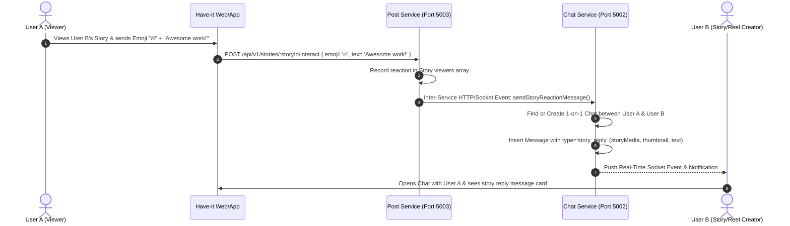

# Have-it "Posts & Social Hub" — Professional Architecture & Requirements Specification

> **Product**: Have-it Unified Super-App (Messenger + Instagram-Grade Social Ecosystem)  
> **Brand Theme**: Electric Cyan (`#03cafc`), Dark-Mode Glassmorphism (`#0b141a`, `#111b21`, `#202c33`)  
> **Supported Platforms**: Cross-Platform Web, Desktop (Windows, macOS, Linux), and all Mobile OS (iOS, Android PWA)  
> **Architecture Pattern**: Fully Decoupled Microservices with Event-Driven and REST/WebSocket Inter-Service Communication  
> **Distributed System Design & Algorithm Whitepaper**: See [POSTS_SYSTEM_DESIGN_AND_FEED_ALGORITHM.md](./POSTS_SYSTEM_DESIGN_AND_FEED_ALGORITHM.md) for billion-scale math, hybrid push/pull fanout, and ML ranking formula.  
> **Monetization & Business Strategy**: See [HAVEIT_MONETIZATION_AND_BUSINESS_STRATEGY.md](../architecture/HAVEIT_MONETIZATION_AND_BUSINESS_STRATEGY.md) for 6 high-revenue streams, creator economy, and zero-cost cloud topology.

---

## 1. System Philosophy & Business Rules

### 1.1 Follow-Graph & Chat Connectivity Rule
- **Mutual/Follow-Driven Messaging**: Users can browse **Followers** and **Following** lists with real-time online status and search.
- Following someone automatically unlocks direct chat initialization with a single click ("Message" button on profile and followers list).
- Privacy controls: Option to accept chat requests or allow direct messages from followers.

### 1.2 Unified Story & Reel Interaction $\rightarrow$ Direct Chat Bridge
- **Stories & Reels Reactions / Replies**: Unlike standard post comments, reacting with an emoji or sending a reply to a **Story** or **Reel** automatically crafts and routes a **Rich Message Card** directly into the sender and recipient's 1-on-1 Have-it chat.
  - The message card embeds the story/reel thumbnail, author badge, and the user's reaction/message with a 24h indicator.
- **Normal Posts Comments**: Comments on standard feed posts remain in the post's dedicated threaded comment drawer.

### 1.3 Full Transparency: Comprehensive Likes & Views Inspection
- **Who Liked My Content**: Post creators can tap the like counter to view the full modal list of users who liked the post (user avatar, display name, handle, follow status, and timestamp).
- **Who Viewed My Content**: Full view-tracking engine for Posts, Reels, and Stories. Creators can see the total view count and the complete list of viewers (with view timestamps).

### 1.4 Real-Time Notification Ecosystem
- Real-time in-app notification drawer + push indicators for:
  - Post & Comment Likes
  - Threaded Comments & Replies
  - New Followers
  - User Mentions (`@username`)
  - Story & Reel Reactions forwarded to Direct Chat

---

## 2. Microservices Topology & Inter-Service Communication

```
                                  ┌─────────────────────────────────────────────────────────┐
                                  │            Have-it Client App (Next.js 15)              │
                                  │  - Messenger (/chat)        - Feed & Stories (/posts)   │
                                  │  - Reels/Shorts (/reels)    - Explore Grid (/explore)   │
                                  │  - Social Profile (/profile)- Activity (/activity)      │
                                  └───────────────────────────┬─────────────────────────────┘
                                                              │ REST / Sockets (JWT Auth)
                      ┌───────────────────────────────────────┼───────────────────────────────────────┐
                      │                                       │                                       │
            ┌─────────▼───────────┐                 ┌─────────▼───────────┐                 ┌─────────▼───────────┐
            │   User Service      │                 │    Chat Service     │                 │    Post Service     │
            │   (Port 5000)       │                 │    (Port 5002)      │                 │    (Port 5003)      │
            │  - Auth & OTP       │                 │  - 1-on-1 & Group   │                 │  - Posts & Reels    │
            │  - Profiles & Bios  │◄───────────────►│  - WebRTC Calls     │◄───────────────►│  - 24h Stories      │
            │  - Follow Graph     │  Inter-Service  │  - Story DM Router  │  Event Dispatch │  - Likers & Viewers │
            │  - Cloudinary Avtr  │   REST/Events   │  - Message Sockets  │  (Like/Comment) │  - Threaded Comments│
            └─────────┬───────────┘                 └─────────┬───────────┘                 └─────────┬───────────┘
                      │                                       │                                       │
                      └──────────────────────────────┬────────┴───────────────────────────────────────┘
                                                     │ RabbitMQ / Mail Queue
                                            ┌────────▼────────────┐
                                            │    Mail Service     │
                                            │   (RabbitMQ Worker) │
                                            │  - OTP Auth Emails  │
                                            │  - Activity Alerts  │
                                            └─────────────────────┘
```

### Microservice Directory Layout
- `backend/user`: Authentication, OTP generation, user profiles, Follow/Unfollow graph, suggested connections.
- `backend/chat`: Real-time chat threads, group chats, WebRTC audio/video call signaling, and Story/Reel reaction bridge.
- `backend/post`: Post creation, multi-image carousels, video reels, 24h stories, threaded comments, likers/viewers inspection, bookmarks, and notification events.
- `backend/mail`: Background transactional email worker.

---

## 3. Database Schemas (MongoDB)

### 3.1 `Post` Schema (`backend/post/src/models/Post.ts`)
```typescript
interface IPost {
  author: mongoose.Types.ObjectId;         // Ref: User
  type: 'image' | 'carousel' | 'video' | 'reel';
  media: Array<{
    url: string;
    public_id: string;
    type: 'image' | 'video';
    aspectRatio?: '1:1' | '4:5' | '16:9' | '9:16';
    thumbnailUrl?: string;
  }>;
  caption: string;                         // Max 2200 chars
  tags: string[];                          // Parsed hashtags e.g. ['haveit', 'tech']
  location?: string;
  likes: mongoose.Types.ObjectId[];        // Array of user IDs who liked
  likesCount: number;                      // Atomic counter
  views: Array<{                           // Detailed views tracking
    user: mongoose.Types.ObjectId;
    viewedAt: Date;
  }>;
  viewsCount: number;                      // Total view count
  commentsCount: number;                   // Total top-level + replies
  isCommentsDisabled: boolean;
  isArchived: boolean;
  createdAt: Date;
  updatedAt: Date;
}
```

### 3.2 `Story` Schema (`backend/post/src/models/Story.ts`)
```typescript
interface IStory {
  author: mongoose.Types.ObjectId;         // Ref: User
  media: {
    url: string;
    public_id: string;
    type: 'image' | 'video';
    thumbnailUrl?: string;
    duration?: number;                     // In seconds (max 30s)
  };
  caption?: string;
  viewers: Array<{                         // Story Viewers list
    user: mongoose.Types.ObjectId;
    viewedAt: Date;
    reactionEmoji?: string;
  }>;
  viewsCount: number;
  expiresAt: Date;                         // MongoDB TTL index: 24 hours from creation
  createdAt: Date;
}
```

### 3.3 `Comment` Schema (`backend/post/src/models/Comment.ts`)
```typescript
interface IComment {
  post: mongoose.Types.ObjectId;           // Ref: Post
  author: mongoose.Types.ObjectId;         // Ref: User
  text: string;                            // Max 500 chars
  parentComment?: mongoose.Types.ObjectId; // Ref: Comment (for nested replies)
  likes: mongoose.Types.ObjectId[];        // Ref: User
  likesCount: number;
  repliesCount: number;
  createdAt: Date;
  updatedAt: Date;
}
```

### 3.4 `Follow` Schema (`backend/user/src/model/Follow.ts`)
```typescript
interface IFollow {
  follower: mongoose.Types.ObjectId;       // User who initiates follow
  following: mongoose.Types.ObjectId;      // User being followed
  status: 'accepted' | 'pending';          // For future private profile support
  createdAt: Date;
}
// Unique compound index: { follower: 1, following: 1 }
```

### 3.5 `Notification` Schema (`backend/post/src/models/Notification.ts`)
```typescript
interface INotification {
  recipient: mongoose.Types.ObjectId;      // Ref: User
  sender: mongoose.Types.ObjectId;         // Ref: User
  type: 'like_post' | 'like_comment' | 'comment' | 'reply' | 'follow' | 'mention' | 'story_reaction';
  post?: mongoose.Types.ObjectId;          // Ref: Post
  comment?: mongoose.Types.ObjectId;       // Ref: Comment
  story?: mongoose.Types.ObjectId;         // Ref: Story
  text?: string;                           // Preview text / emoji reaction
  isRead: boolean;
  createdAt: Date;
}
```

### 3.6 `Bookmark` Schema (`backend/post/src/models/Bookmark.ts`)
```typescript
interface IBookmark {
  user: mongoose.Types.ObjectId;           // Ref: User
  post: mongoose.Types.ObjectId;           // Ref: Post
  collectionName: string;                  // Default: 'All Posts'
  createdAt: Date;
}
```

---

## 4. Complete REST & WebSocket API Specification

### 4.1 Post Service Endpoints (`http://localhost:5003/api/v1`)

| Method | Endpoint | Description | Auth Required |
|---|---|---|---|
| `GET` | `/posts/feed` | Paginated social feed (followed accounts + recommendations) | ✅ Yes |
| `POST` | `/posts` | Create new single/carousel/video/reel post | ✅ Yes |
| `GET` | `/posts/explore` | Explore grid (trending & popular posts) | ✅ Yes |
| `GET` | `/posts/user/:userId` | Get all posts/reels for a user profile grid | ✅ Yes |
| `GET` | `/posts/:postId` | Get single post details with metadata | ✅ Yes |
| `DELETE` | `/posts/:postId` | Delete own post | ✅ Yes |
| `PUT` | `/posts/:postId/like` | Toggle like/unlike on post (atomic update) | ✅ Yes |
| `GET` | `/posts/:postId/likers` | **Get full list of users who liked this post** | ✅ Yes |
| `GET` | `/posts/:postId/viewers` | **Get full list of users who viewed this post** | ✅ Yes |
| `POST` | `/posts/:postId/view` | Record a view from current user | ✅ Yes |
| `PUT` | `/posts/:postId/bookmark` | Save / unsave post to collection | ✅ Yes |
| `GET` | `/posts/saved` | Get user's saved/bookmarked posts | ✅ Yes |

### 4.2 Comments Endpoints (`/api/v1/posts/:postId/comments`)

| Method | Endpoint | Description | Auth Required |
|---|---|---|---|
| `GET` | `/posts/:postId/comments` | Get paginated comments with nested replies | ✅ Yes |
| `POST` | `/posts/:postId/comments` | Add a comment or reply to `parentCommentId` | ✅ Yes |
| `DELETE` | `/posts/comments/:commentId` | Delete comment (author or post owner) | ✅ Yes |
| `PUT` | `/posts/comments/:commentId/like` | Toggle like on a comment | ✅ Yes |

### 4.3 Stories & Reel Interaction Endpoints (`/api/v1/stories`)

| Method | Endpoint | Description | Auth Required |
|---|---|---|---|
| `GET` | `/stories/feed` | Active 24h stories grouped by followed user | ✅ Yes |
| `POST` | `/stories` | Upload and publish 24h story | ✅ Yes |
| `GET` | `/stories/:storyId` | Get single story | ✅ Yes |
| `PUT` | `/stories/:storyId/view` | Record viewer with timestamp | ✅ Yes |
| `GET` | `/stories/:storyId/viewers` | **Get full list of story viewers & reactions** | ✅ Yes |
| `POST` | `/stories/:storyId/interact` | **React/Reply to story $\rightarrow$ routes message card to Direct Chat** | ✅ Yes |
| `DELETE` | `/stories/:storyId` | Delete own story | ✅ Yes |

### 4.4 Social Graph Endpoints (`http://localhost:5000/api/v1/user/follow`)

| Method | Endpoint | Description | Auth Required |
|---|---|---|---|
| `POST` | `/follow/:targetUserId` | Follow a user (enables chat & feed visibility) | ✅ Yes |
| `POST` | `/unfollow/:targetUserId` | Unfollow a user | ✅ Yes |
| `GET` | `/:userId/followers` | Get full followers list (searchable, with chat link) | ✅ Yes |
| `GET` | `/:userId/following` | Get full following list (searchable, with chat link) | ✅ Yes |
| `GET` | `/suggestions` | Suggested users to follow | ✅ Yes |

### 4.5 Notifications Endpoints (`/api/v1/notifications`)

| Method | Endpoint | Description | Auth Required |
|---|---|---|---|
| `GET` | `/notifications` | Get user notifications stream | ✅ Yes |
| `PUT` | `/notifications/read` | Mark all notifications as read | ✅ Yes |

---

## 5. Story / Reel Direct Message Routing Mechanism



---

## 6. Frontend Navigation & Screen Architecture

### 6.1 Unified Master Navigation
- **Desktop**: Left navigation rail with Have-it Logo, Messages (badge), Feed, Explore, Create (+), Activity (heart badge), Profile.
- **Mobile**: Bottom tab bar with Chat, Feed, Create (+), Activity, and Profile.

### 6.2 Frontend Page & Component Structure
```
frontend/src/
├── app/
│   ├── chat/page.tsx               # Have-it Messenger (Existing)
│   ├── posts/page.tsx              # Instagram-Style Feed & Stories Bar
│   ├── explore/page.tsx            # Explore Discovery Grid & Search
│   ├── reels/page.tsx              # Fullscreen Vertical Reel Stream
│   └── profile/
│       └── [userId]/page.tsx       # Dynamic Social Profile & 3-Column Grid
├── components/
│   ├── HaveItNavbar.tsx            # Top/Bottom Dual Hub Switcher (Chat vs Posts)
│   ├── posts/
│   │   ├── StoriesBar.tsx          # Top Stories Avatar Reel with #03cafc rings
│   │   ├── StoryViewerModal.tsx    # Fullscreen Story Player with Timer & DM Reply
│   │   ├── PostCard.tsx            # Feed Post (Carousel, Double-Tap Heart, Actions)
│   │   ├── LikersModal.tsx         # Full Likers List Inspector (Avatars + Follow status)
│   │   ├── ViewersModal.tsx        # Full Viewers List Inspector (Avatars + Timestamps)
│   │   ├── CommentsDrawer.tsx      # Slide-Up Threaded Discussion with Mentions
│   │   ├── CreatePostModal.tsx     # Studio Dialog (Crop, Carousel, Tagging, Cloudinary)
│   │   ├── CreateStoryModal.tsx    # Fast 24h Story Creation Dialog
│   │   ├── FollowListModal.tsx     # Followers / Following List with Direct Chat trigger
│   │   └── ActivityDrawer.tsx      # Notifications Center (Likes, Follows, Mentions)
│   └── reels/
│       └── ReelPlayer.tsx          # Autoplay vertical video player with sound toggle
```

---

## 7. Professional Execution Phases & Roadmap

### Phase 1: Microservice Setup & Database Models (`backend/post`)
- Scaffold `backend/post` microservice (TypeScript, Express 5, Mongoose 8, Multer, Cloudinary, Socket.IO).
- Define models: `Post.ts`, `Story.ts`, `Comment.ts`, `Follow.ts`, `Bookmark.ts`, `Notification.ts`.
- Set up JWT authentication middleware and cross-service HTTP client.

### Phase 2: Post CRUD, Feed Engine, Likers & Viewers APIs
- Build feed aggregation pipeline (posts from followed accounts + top public posts).
- Implement multi-image carousel & video upload via Cloudinary.
- Implement atomic likes counter, likers inspection endpoint, view counter, and viewers inspection endpoint.
- Implement bookmarking / collections.

### Phase 3: 24h Stories Engine & Direct Chat Routing Bridge
- Implement story upload with 24-hour TTL automatic expiration.
- Implement story viewers inspector.
- Build Story Reaction $\rightarrow$ Chat Service message bridge creating instant DM rich cards.

### Phase 4: Threaded Comments & Follow Graph
- Implement comments and nested replies with `@mention` tagging parser.
- Implement follow/unfollow system with follower & following lists.
- Implement follow-to-chat authorization verification.
- Implement activity notification generator.

### Phase 5: Frontend Feed, Stories Bar & Story Viewer
- Build unified `HaveItNavbar.tsx` for seamless 1-tap switching between Chat and Posts.
- Create `/posts` page with dynamic feed stream and infinite scroll.
- Build `StoriesBar.tsx` and fullscreen `StoryViewerModal.tsx` with progress bar and DM reply input.
- Build `PostCard.tsx` with image carousel, double-tap heart animation, and `#03cafc` theme styling.

### Phase 6: Likers/Viewers Modal, Comments Drawer & Create Studio
- Build `LikersModal.tsx` and `ViewersModal.tsx` for full creator transparency.
- Build `CommentsDrawer.tsx` for threaded discussions.
- Build `CreatePostModal.tsx` and `CreateStoryModal.tsx` with crop presets (1:1, 4:5, 16:9).

### Phase 7: Explore Grid, Reels Stream & Social Profile
- Create `/explore` page with 3-column discovery grid and search filters.
- Create `/reels` page for vertical video clips.
- Enhance `/profile` with Instagram-style 3-column tabs (Posts, Reels, Saved, Tagged) and Followers/Following modals.

### Phase 8: Real-Time Sockets, E2E Testing & Production Verification
- Wire up Socket.IO events for live likes, comments, and notifications.
- Test cross-service message forwarding between `backend/post` and `backend/chat`.
- Run full Next.js production build (`npm run build`) and microservices health check.
